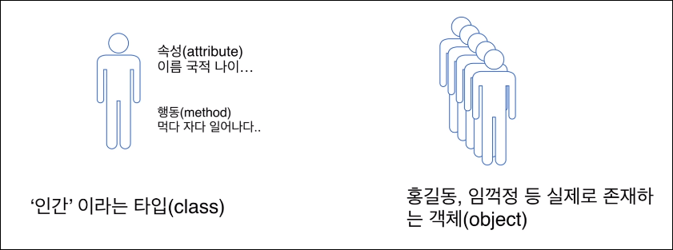
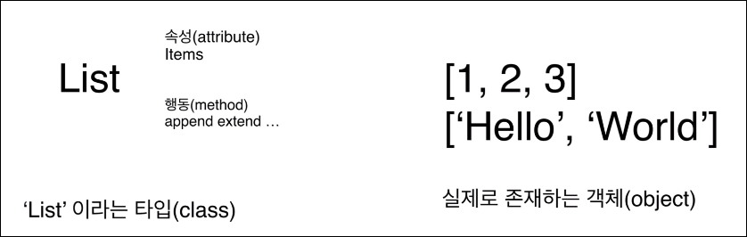

# Class & Object

## Class와 Object(객체) 이해

> '인간'이라는 추상적인 개념은 type, Class 이고

> 나, 부모님, 친구 등 실제로 존재하는 사람을 Object 라고 함

- 'List' 라는 타입
  - List 가 가지는 attribute, method 등을 가짐

- List의 Object는 숫자, 글자 등 구체적으로 메모리에 잡혀있는 그 자체, 상태

- 클래스는 틀이고, 객체는 그 틀로 만들어 낸 것들

## 생성자(__init__)의 이해 및 사용
> 파이썬 객체가 생성되는 순간 호출되는 함수

### __init__(self)
- 생성자, 클래스 인스턴스가 생성될 떄 호출됨
- self 인자는 항상 첫번쨰에 오며, 자기 자신을 가리킴
- 이름이 꼭 self일 필요는 없지만, 관례적으로 self 로 사용
- 생성자에서는 해당 클래스가 다루는 데이터를 정의
  - 이 데이터를 멤버 변수(member variable) 또는 속성(attribute)라고 함

