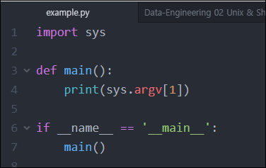
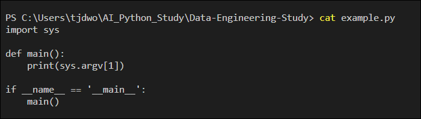

# Data-Engineering 02 - Unix 환경 및 커멘드

## Unix 기본 Commands
1. Navigating Files and Directions
  - cd path
  - ls path
  - pwd
  - etc
2. Files and Directories
  - cd old new
  - mkdir path
  - rm path
  - etc
3. Pipes and Filters
  - cat
  - head
  - tail
  - command > file
  - command >> file

---
### Commands
- ls: 해당 경로 안의 파일들 확인
- mkdir 'folder name': 입력한 이름의 폴더 생성
- pwd: 본인의 현재 경로 확인
- cd .. : 이전 경로로 이동
- ctrl + l: 위의 내용들 clear
- cp '파일이름' '폴더이름': 해당 경로의 파일을 지정한 폴더로 이동/복사
- rm '파일/폴더이름': 지정한 파일/폴더 삭제
  - 폴더를 cp 하거나 rm 하려면 뒤에 -r 을 넣어줘야 함
- cat '파일이름': 지정한 파일내용 프린트
- head: 앞에서 10줄, tail: 뒤에서 10줄
- command '파일1' > '파일2': 파일 1의 내용을 파일2에 저장(덮어쓰기)
- command '파일1' >> '파일2': 위와 동일한데 덮어쓰기가 아닌 뒤에 이어서 추가 (append)

---

## Shell Scripting
> 전에 배운 명령어들로 실제 command 환경에서 사용해보겠음

### 실습
- 'example.py' 파일 하나를 생성

- cat example.py 명령어 실행

  - example.py 파일 내용 확인 가능

- 'run.sh' 라는 shell script 확장자인 파일 생성

- 내부에 
  - python example.py 1
  - python example.py 2
  - 등의 명령을 입력해놓고 커멘드 창에서 해당 shell script 파일을 실행시키면 
  - shell script 내부에 적힌 명령이 순서대로 실행됨

- 이처럼 순차적으로 실행 시켜줘야하는 명령들이 있다면 shell script 파일형태로 저장 해놓고 추후에 실행시켜주면 됨
  - 보통 'deploy.sh' 라는 파일이름으로 저장해둠
