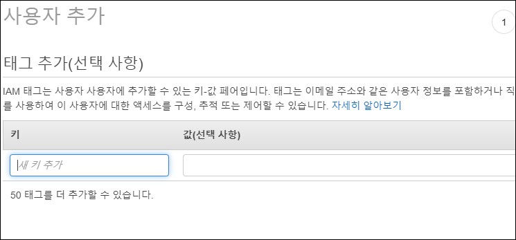

# Data-Engineering 03 - AWS (Amazon Web Service) Basic

## AWS CLI (Command Line Interface)
> CLI를 이용해 AWS와 통신하기 위한 기본작업을 진행하겠음

> 현재 사용중인 AWS 계정은 free tier 임

### Installing AWS CLI
-  커멘드 창을 열어서 아래 명령어 입력
    ```linux
    pip install awscli --user
    ```

    

- 위의 방법으로 했더니 안되서(맥에서는 바로 되는듯) 직접 설치하는 방법으로 진행
- [AWS CLI](https://docs.aws.amazon.com/cli/latest/userguide/install-cliv2-windows.html) 페이지에서 직접 다운
    
    
    
    - 커멘드 창에서 'aws --version' 명령어 입력시 위와 같이 나오면 설치 완료
  

### IAM(Identity and Access Management) 확인 및 User 추가
- 이름 그대로 사용중인/활성화된 계정에 대한 관리 및 권한 관리를 함
- [AWS IAM](https://aws.amazon.com/ko/iam/?nc2=type_a)에 접속하여 시작하기

    

- 계정 생성하기
    
    
    
    - 우리는 CLI를 쓸 예정이므로 '프로그래밍 방식 엑세스' 부분 선택
    
    - 그룹 생성하기 인데, 추후에 다수의 인원들과 프로젝트 진행시에 작업해주면 되고 이번엔 혼자 진행하는것이라 일단 Pass~
    - 3번째의 '기존 정책 직접 연결' 을 클릭하여 'AdministratorAccess' 권한을 받고 진행하기
    
    - 태그도 일단 Pass~
    
    - 마지막 검토 후 계정생성
    
    - 계정 생성완료하여 User ID와 AccessKey 를 얻음

### Configure 작업하기
- [AWS CONFIG](https://docs.aws.amazon.com/cli/latest/userguide/cli-chap-configure.html)해당 페이지에서 필요 내용 파악후 CLI로 작업하기

    

- 커멘드 창을 열고 아래 명령어 입력
    ```linux
    aws configure
    ```

- 본인의 AccessKey 등 정보 입력
  
    
    - 'region name' 에는 가장 가까운 서울리전인 'ap-northeast-2'를 입력
    - output format 은 'none'로 진행

- 이제 CLI로 AWS와 다양한 통신을 주고받을 수 있게 됨
  - ShellScript로 작업해둔 AWS 명령어들을 일괄적으로 실행가능함


  