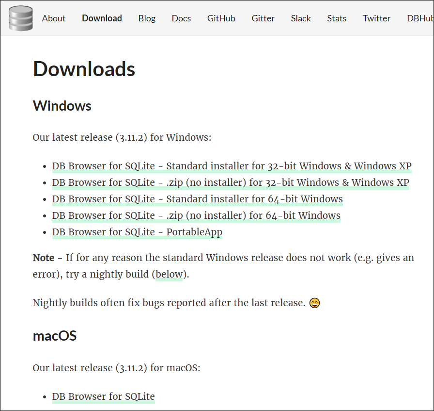
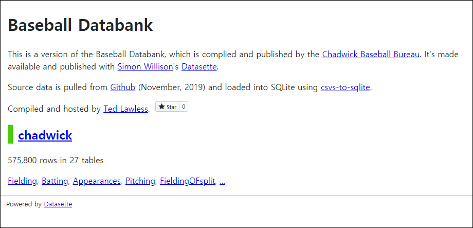
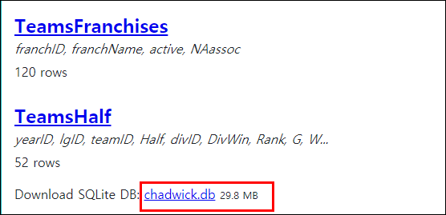
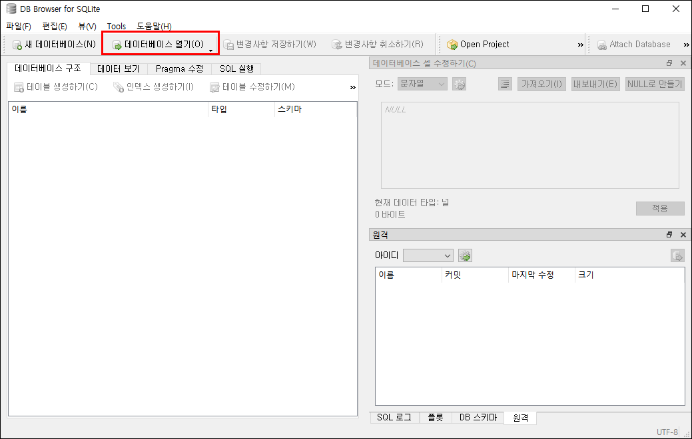
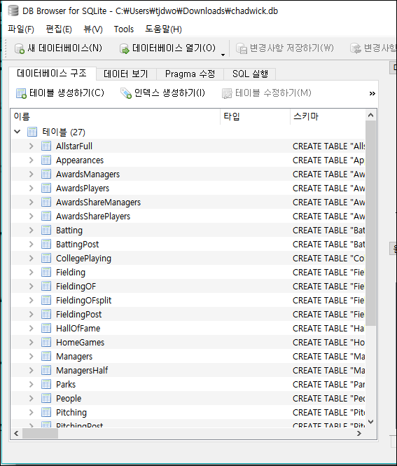

# Data-Engineering 04 - SQL

## Pre-requisites
> DB(데이터 저장소)를 관리할때 쓰이게될 언어인 SQL을 실습하기 위한 기본작업을 진행해보겠음

### SQLite 설치
- (SQLite)[https://sqlitebrowser.org/dl/] 페이지 접속 후 각 OS, 버전에 맞는 SQLite 설치

    
  
### Data 다운
- SQL 실습에 사용할 야구 data를 다운받아야함
- [BaseballDB](https://baseballdb.lawlesst.net/) 페이지에서 데이터 다운
  
    
    
    - 페이지 최하단으로 내려가서 DB 다운
- 기존에 설치한 SQLite를 실행 후 다운받은 DB 열어주기
  
    
    

- 준비 끝!

