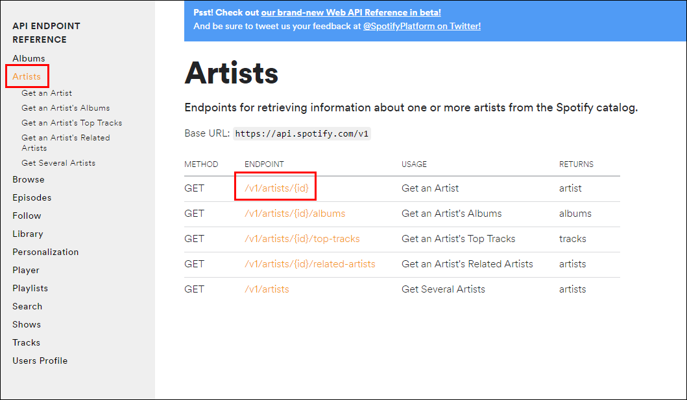
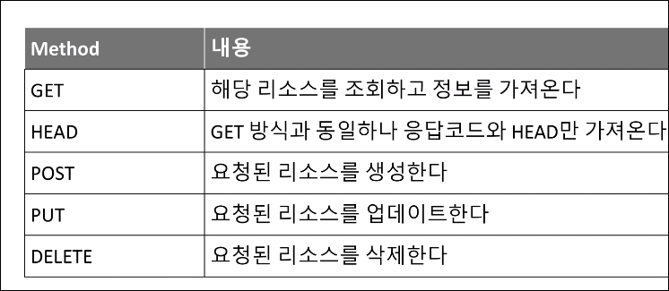
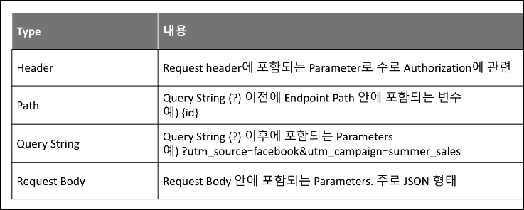
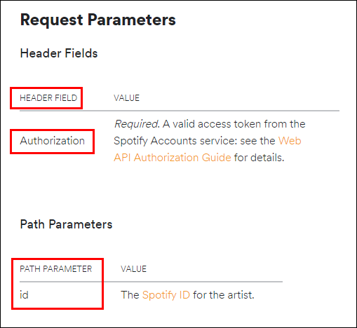

# Data-Engineering 05 - API(2) Spotify Web API, Endpoints & Mmethods, Parameters

## Spotify Web API 개요
> 해당 프로젝트에서 Spotify의 Web API를 이용해 여러 아티스트의 정보를 가져올 것임

### Spotify Web API
- [Spotify for Developer](https://developer.spotify.com/documentation/web-api/)에 접속

    

- Rate Limiting
  - API를 제공하는 Spotify 측에서 들어오는 Request에 대해 제한을 둠 (무한한 요청에대해 response 해주진 않음)

### Data, Reference
> 우리가 API를 통해 가져올 수 있는 데이터에는 어떤것이 있는지 알아보겠음

- Reference 들어가서 살펴보기

    
     
     
    - Artist에 대한 마스터 정보를 가져올 수 있음
    - 우측에 어떠한 데이터를 가져 올 수 있는지 샘플이 있음
    - 우리는 좌측의 많은 리소스들이 있고 그 중 'Artist's Top Tracks' 에 대한 정보를 많이 사용하게 될것임

---

## Endpoints & Methods
> API를 요청할때 필요한 Endpoints와 Methods에 대해 알아보겠음

     
    - Artist API 정보를 보면 Method와 Endpoint 확인 가능


### Resource
- Resource는 API를 통해 리턴된 정보

- 하나의 Resource안에 여러개의 Endpoints가 존재
  
   
  - 'Artists' 라는 resource에는 여러 Endpoints가 존재

### Endpoint
- Resource를 엑세스하는 경로/방법
- 내가 데이터를 가져오려는/요청하는 URL의 값, 경로, 어디다 요청을 해야하는지, 포인트, 지점

### Method
- 자원(데이터) 접근에 허용된 행위(Get, POST, PUT, DELETE)

   

- Methods 정의
  
   
  - HEAD: API가 잘 작동되는지 확인용으로 많이 쓰임

   
  - 'GET' 부분이 method, 그 뒷부분이 Endpoint


---

## Parameters
> Endpoint를 통해 리퀘스트 할때 같이 전달하는 옵션들

### Parameter 타입

   
   
   
  - Artist의 경우 Header Parameter에 Authorization이 들어가야하고
  - Path Parameters에는 Artist의 id가 들어감
  - Top Tracks에 들어가면 Query Parameters도 확인가능

- 예시
    ```linux
    curl -X GET "https://api.spotify.com/v1/artists/43ZHCT0cAZBISjO8DG9PnE/top-tracks?country=SE" -H "Authorization: Bearer {your access token}"
    ```
    - 예시의 'artists/' 이후 부분에 path parameter(Artist ID)가 들어가고
    - country=SE 부분이 Query Parameter
    -  -H 라고 되있는 부분이 Header 부분이고 그 안에 Authorization 이 들어감


