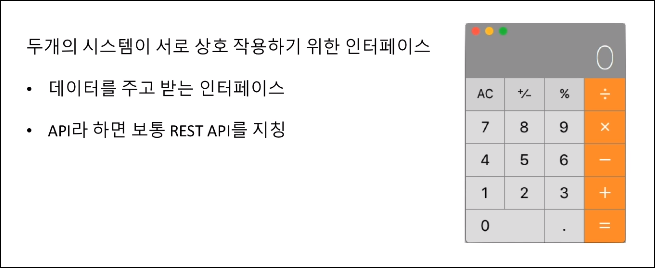
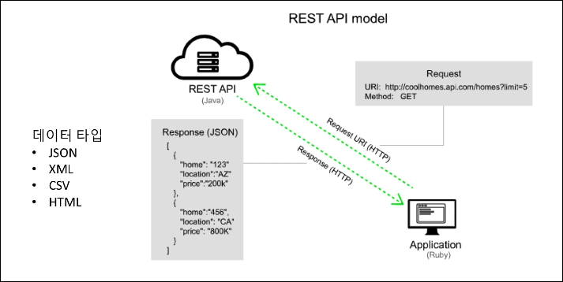
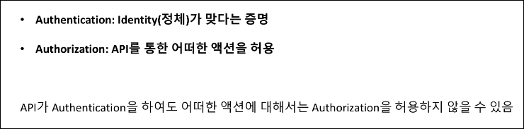
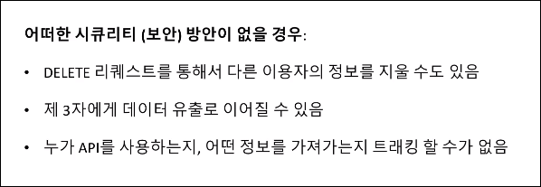
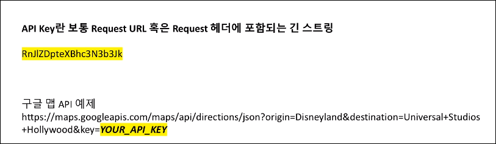
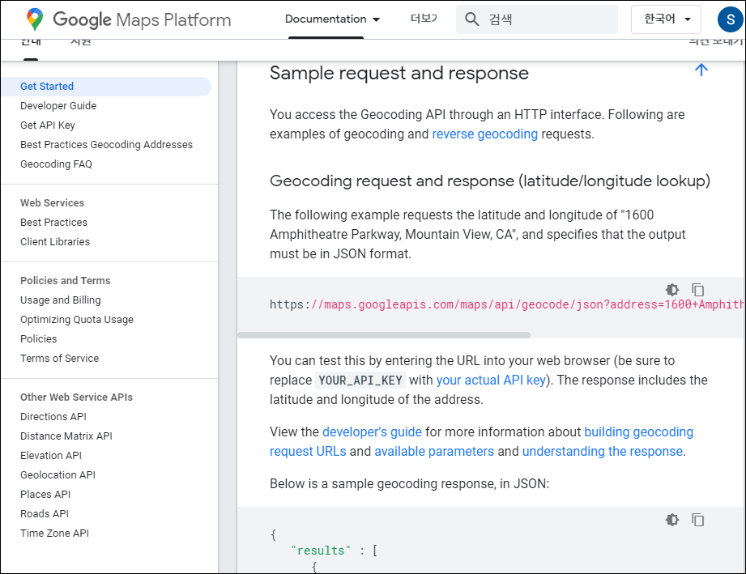
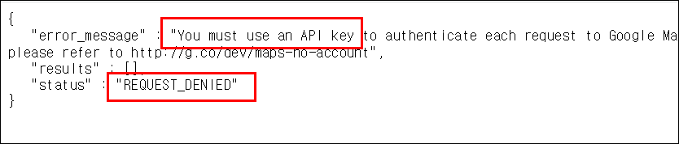
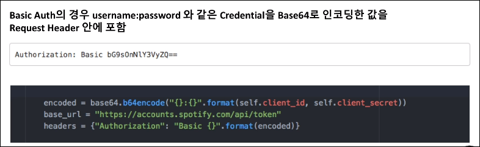
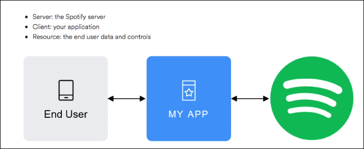

# Data-Engineering 05 - API(Application Programming Interface)

## REST API의 정의와 예제들
> API의 무엇인지에 대한 정의와 몇몇 예제들에 대해 보겠음

### API란
- Application Programming Interface의 약자

    
    - 계산기 프로그램에 내가 5+5 라는 식을 입력하면
    - 계산기 내부에서 해당 값들을 계산하여 10이라는 결과값을 출력
    - 이와 같이 서로 데이터를 주고받는 것을 API라고 지칭함
    - 보통 REST API 라고 지칭

### Web API란 웹을 통해 외부 서비스들로부터 정보를 불러오는 API
- 외부의 어떤 서버, 서비스에 요청을 하고 받는 등 정보를 주고받는 행위를 함
    
    - 나의 컴퓨터(Application)로 입력한(Request) 어떤 값이 HTTP라는 경로(프로토콜)를 통해서 어느 서버에 전달이 됨
    - 그럼 그 서버(REST API)는 내가 입력한 값이 어떤것인지 파악후 여러 데이터 타입(JSON, HTML)으로 대답해줌(Response)

- **웹사이트는 HTTP(s) 프로토콜을 사용하는 REST API 기반으로 구축된것**

---

## API Authorization (접근 권한)
> 크게 2가지가 존재 Authetication 과 Authorization

### Authentication VS Authorization
- Authentication: 
  - 내가 API라고 가정하고 어떤 Interface에 Data를 달라고 요청을 하면 
  - 이 API가 누구/어떤 API인지 확인/증명 하는 것

- Authorization:
  - Authentication에서 API에 대한 증명을 한 후
  - 데이터를 줄 것인지 말 것인지, 준다면 어떠한 데이터를 줄 것인지에 대해 고려 하는 것

    

### Security
- API의 필수는 첫째도 시큐리티, 둘째도 시큐리티
- API를 통해 상대방(서버)의 데이터를 지울 수 도 있기 때문에 보안에 신경써야함

    

### API Key
- 보통 API에 접근하기 위해선 Acess key 가 있어야 함
- Request를 보낸 사람이 해당 API에 접근 권한이 있는지 확인 

    

- [GoogleMap](https://developers.google.com/maps/documentation/geocoding/start) 페이지에 들어가면 구글맵 API가 어떻게 작동되는지 볼 수 있음

    

- key 없이 API에 접근하려면 아래와 같이 Request Denied 라고 뜸

    
 
### Basic Auth
- 접근할 수 있는 권한에는 여러가지가 있는데 GoogleMap 같은 경우는 Request URL에 포함을 시켰고
- HTML Request Header 안에 권한 정보를 입력해주는 경우도 있음 = Basic Auth
  
    
    - Base64라는 인코딩(암호화) 방식으로 string 을 만들어 header에 입력

### OAuth 2.0
- 최근에 가장 많이 쓰이는 방식이라고 함

    

- Spotify의 Flow를 예로들면
  - Spotify의 각 유저들(End User)이 어떤 음악 리스트를 만들었고 어떤 아티스트를 팔로우 하는지에 대한 정보를 
  - 'My App'에서 가져가도 되는지에 대한 권한을 유저들(End User)로부터 먼저 얻고
  - 그런 권한을 얻었다는 것을 Spotify API에게 알려주면 해당 정보를 가져올 수 있게 됨
    
