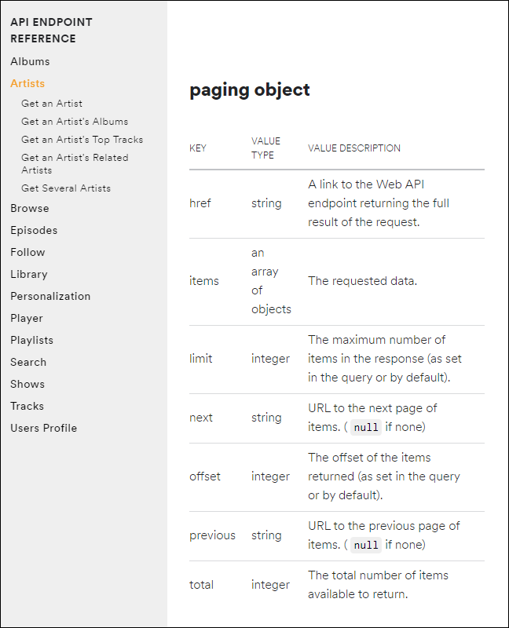
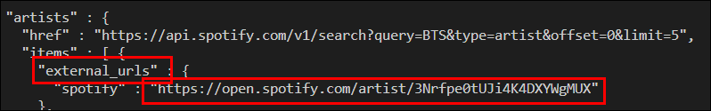
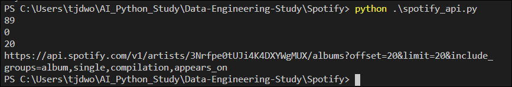
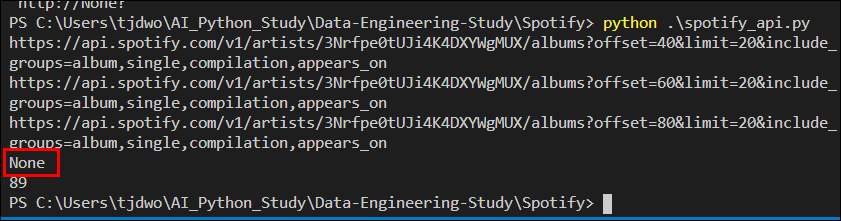

# Data-Engineering 06 - Spotify API (2)(StatusCode, 페이지네이션 핸들링)

## Status Code
> API를 사용했을때 내가 보낸 요청에 대한 응답코드들 임

> 각 응답코드마다 다른 내용을 담고 있음

### Response Status Code
- Spotify의 [Web-API](https://developer.spotify.com/documentation/web-api/) 페이지에 들어가면 각 코드들에 대한 설명확인 가능

    
    - 200: request 성공, 200번대는 주로 성공한 것
    - 400~500 번대는 주로 문제가 있는 것
    - 400: bad request, 잘못된 문법으로, 잘못된 요청이 들어왔음
    - 401: unauthorized, credential 또는 access_token이 잘못 됨

- 우리쪽에서 문제가 있어서 API 호출을 못하는 경우도 있지만, Spotify 서버 자체적으로 문제가 생기는 경우도 있음
    - error code, status code 등으로 문제해결을 위한 정보를 얻을 수 있어야 함

- 429 code의 경우 너무 빠른시간에 많은 내용을 호출하면 문제가 생길 수 있어 제한을 둠 (rate limiting)
    - 만약 작동이 안되면 우리의 Python 스크립트가 멈추게됨
    - 설정된 시간 안에 재호출을 하면 다시 사용 가능하게 설정되 있음

---

## Error Handling
> Status Code를 통해서, 에러가 발생했을때 어떤식으로 대처를 해야하는지에 대해 알아보겠음

### Clinet ID의 일부가 틀린 경우
- Clinet ID의 일부를 수정해보았음
- get_headers 함수 내부에 status_code를 출력하는 코드 입력
   
  ```python
  r = requests.post(endpoint, data = payload, headers=headers)
    print(r.status_code)
    print(r.text)
    print(r.headers)
    sys.exit(0)
  ```

    
    - 400이라는 에러코드와 함께 'invalid_client'라는 내용을 담고있는 메세지 출력

### 실제 Spotify의 서버에 문제가 있거나 너무 많은 요청을 보내 429 에러코드를 받을 경우
- 문제가 생길만한 부분이 있다고 판단되는 부분에 Try-Except 를 사용하여 대비

    ```python
    # 요청을 보냈을때 문제가 생길경우 스크립트가 멈추게 한 뒤, 에러내용 확인하도록 하는 방식
    try:
        r = requests.get("https://api.spotify.com/v1/search", params = params, headers=headers)
    except:
        logging.error(r.text)
        sys.exit(1)
    ```

- 이미 알고있는, 충분히 예상되는 에러코드가 뜰때를 대비

    ```python
    if r.status_code != 200:
        # status_code가 200이 아닌경우 에러내용 로깅
        logging.error(r.text)

        # 429 코드라면
        if r.status_code == 429:

            # 'Retry-After'의, 내용 저장
            retry_after = json.loads(r.headers)['Retry-After']
            # 'retry_after' 만큼 정지
            time.sleep(int(retry_after))

            # 다시 요청 보내기
            r = requests.get("https://api.spotify.com/v1/search", params = params, headers=headers)
            
        # access_token expired = 401
        elif r.status_code == 401:

            # 새로운 access_token 발급받기
            headers = get_headers(client_id, client_secret)
            # 새로운 header로 재시도
            r = requests.get("https://api.spotify.com/v1/search", params = params, headers=headers)

        # 또 다른 이유라면 종료
        else:
            sys.exit(1)

    ```

---

## 페이지네이션 핸들링
> 한번에 받아올 수 있는 데이터의 양을 조절하기 위해(서버 과부하를 줄이기 위해) 스포티파이 자체적으로 옵션을 만들어 둠, 다른 API들도 대부분 이런 기능 있음.

### Paging Object
- 'get an Artist's Albums' api 내용 중 제일 아래에 위치
    
    - 해당 옵션들을 API 사용중에 추가가능
    - limit의 deafult는 20, minimum은 1로 되어 있음
    - offset은 0으로, 첫번째 앨범부터 검색하는것으로 default

### BTS 엘범정보 검색
- 기존의 코드를 실행시키면 BTS에 대한 정보 나옴
- External URL로 확인해보기

    
    

- BTS id 값 카피 후 사용을 위한 코드 작성

    ```python
        # BTS IT를 넣어서 앨범정보 가져오기
        r = requests.get("https://api.spotify.com/v1/artists/3Nrfpe0tUJi4K4DXYWgMUX/albums", headers=headers)
    
        raw = json.loads(r.text)

        total = raw['total']
        offset = raw['offset']
        limit = raw['limit']
        next = raw['next']

        # 앨범정보 출력
        print(total) # 89개
        print(offset) # 0번째부터
        print(limit) # 디폴트 20
        print(next) # offset이 20부터 시작함(디폴트로 20까지 했기떄문에)
        sys.exit(0)
    ```
    
    - 실행값

- 엘범정보 가져오기
    ```python
        # 최대 100개만 뽑아 오겠다
        count = 0
        # 100보다 작고, next가 있을때까지만
        while count < 100 and next:
            # next값을 넣어줘서 다음 페이지 불러오기
            r = requests.get(raw['next'], headers=headers)
            raw = json.loads(r.text)
            # 불러온 next의 next값을 새로운 next값으로 넣어주기
            next = raw['next']
            print(next)
             
            # extend, items 계속 추가해주기
            albums.extend(raw['items'])
            count = len(albums)

        print(len(albums))
    ```

    
    - next가 3번 출력되고
    - 더이상 가져올 값이 없을때 None값 출력됨
  
