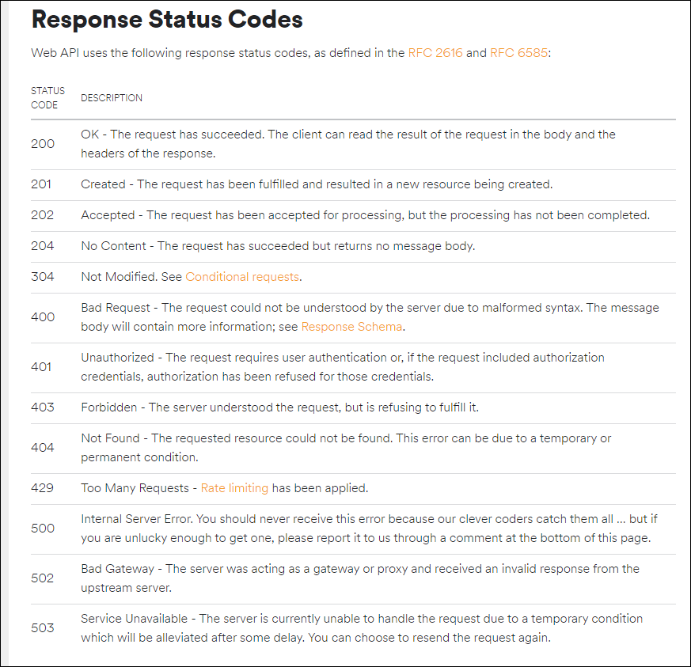

# Data-Engineering 06 - Spotify API (2)

## Status Code
> API를 사용했을때 내가 보낸 요청에 대한 응답코드들 임

> 각 응답코드마다 다른 내용을 담고 있음

### Response Status Code
- Spotify의 [Web-API](https://developer.spotify.com/documentation/web-api/) 페이지에 들어가면 각 코드들에 대한 설명확인 가능

    
    - 200: request 성공, 200번대는 주로 성공한 것
    - 400~500 번대는 주로 문제가 있는 것
    - 400: bad request, 잘못된 문법으로, 잘못된 요청이 들어왔음
    - 401: unauthorized, credential 또는 access_token이 잘못 됨

- 우리쪽에서 문제가 있어서 API 호출을 못하는 경우도 있지만, Spotify 서버 자체적으로 문제가 생기는 경우도 있음
    - error code, status code 등으로 문제해결을 위한 정보를 얻을 수 있어야 함

- 429 code의 경우 너무 빠른시간에 많은 내용을 호출하면 문제가 생길 수 있어 제한을 둠 (rate limiting)
    - 만약 작동이 안되면 우리의 Python 스크립트가 멈추게됨
    - 설정된 시간 안에 재호출을 하면 다시 사용 가능하게 설정되 있음

---

## Error Handling
> Status Code를 통해서, 에러가 발생했을때 어떤식으로 대처를 해야하는지에 대해 알아보겠음

### 