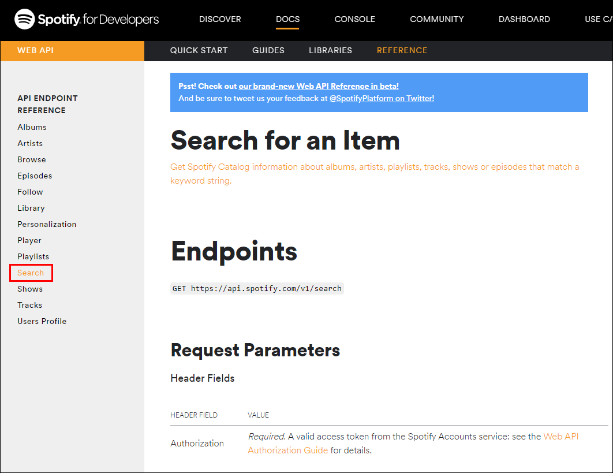
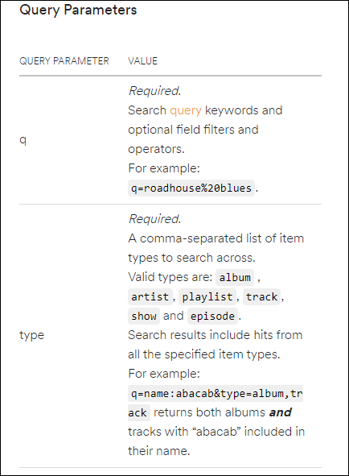
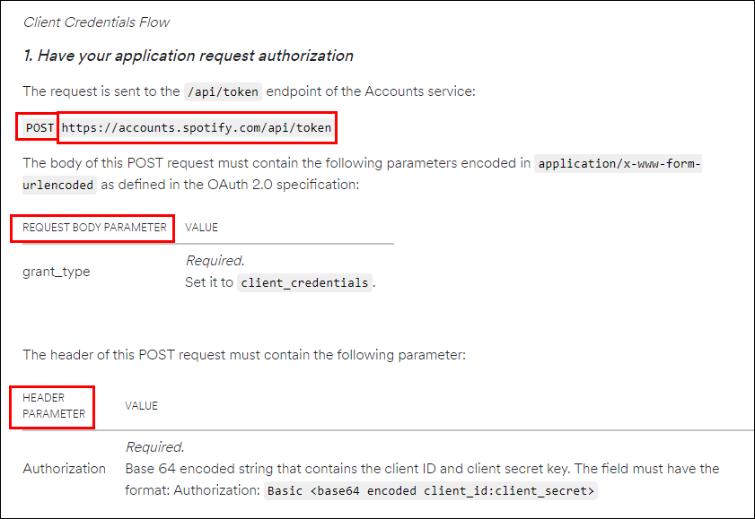
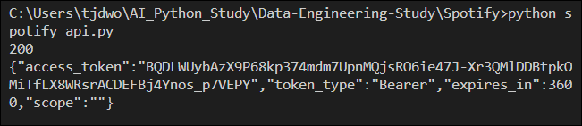
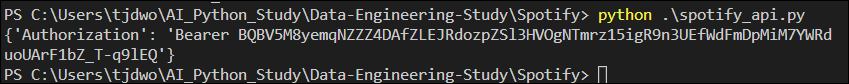
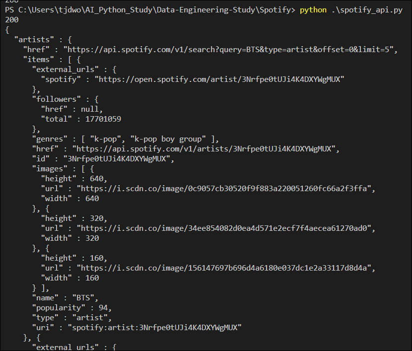

# Data-Engineering 06 - Spotify API

## Spotify App 생성 및 토큰 발급
> Spotify의 Web API를 사용하기 위한 토큰 발급이 필요

### General Guide
- [Spotify General Guide](https://developer.spotify.com/documentation/general/guides/authorization-guide/)에 들어가서 하단부에 보면 'Client Credentials Flow' 라고 있음
    - 우리가 API를 사용하는 흐름을 보여줌

  
  - 우리가 Apotify Accounts Service에 필요 정보 보내기
  - Spotify으로부터 access token 제공 받음
  - 제공 받은 access token을 Spotify Web API에 보내기
  - Json 객체로 정보를 보내줌

  
  - 한 번 보낸 access token의 유효기간이 3600초 = 1시간 임
  - 다시 사용하기 위해선 한시간 뒤에 또다시 access token을 받는 과정 진행해야 함

### App 생성하기
> Client와 API가 서로 어떻게 작용하는지 전체를 관장하는 곳
- 페이지 상단의 Dashboard 들어가서 로그인, App 생성하기

  
  
  
  - 앱 생성 완료!

---

## Python 기본문법
> Spotify API를 사용하기 위한 Python 기본에 대해 알아보겠음

### Python 스크립트 저장을 위한 폴더 만들어주기
- 터미널을 열고(굳이 터미널에서 할 필요는 없음) 앞으로 작성할 Python 스크립트를 저장할 폴더 생성해주기
- 'Spotify' 라는 폴더에 'spotify_api.py' 파일 생성해줌

  

- 코드설명

  ```python
  # 필요 패키지 임포트
  import sys

  # 이 스크립트가 작동할때 실행되는 main 함수
  def main():
      print('Spotify')

  # 만약 name 이 main 이면, main() 함수를 실행시켜라
  if __name__ == '__main__':
      main()

  ```
---

## Python Requests 패키지
> API 사용에 필요한 python 라이브러리인 Requests 패키지에 대해 알아보겠음

### Requests 설치
- [Requests](https://requests.readthedocs.io/en/master/) 페이지에서 기본 설명 확인 가능

  

- 페이지 제일 하단부의 'Developer Interface'에 들어가면 우리가 사용할 패키지에 대한 기본 설명있음

  

  - 앞으로 자주 사용할 기능들에 대한 설명이 있음

  

- 터미널에서 'pip install requests' 명령어로 requests 설치

#### Tip
> requests 설치시 본인 같은 경우, 기존에 requests가 python2에도 설치되어 있고, 가상환경에도 설치되어 있음

> 추후에 python3를 설치하고 requests install 하려하니 (path는 기존의 python2에서 변경하여 python3로 잡혀있음) 이미 설치되어 있다고 함
>> 그러나 막상 import 하면 없는 module 이라고 함

> 이처럼 환경이 꼬여서 인식이 안될때는, 패키지 설치가 아직 되지 않은 그 환경에서 해당 명령어 입력
>> python -m pip install '패키지' (or python3 -m pip install requests)

#### 추가
- For centos: yum install python-requests For Ubuntu: apt-get install python-requests

- If you manually want to add a library to a windows machine, you can download the compressed library, uncompress it, and then place it into the Lib\site-packages folder of your python path. (For example: C:\Python27\Lib\site-packages)

---

## API를 통해 데이터 요청
> Spotify의 Search API를 통해 가수,곡 등의 정보들에 대해 검색을 해볼것임

### Search API
- [Spotify Search API](https://developer.spotify.com/documentation/web-api/reference/search/search/)에 접속하면 (Spotify의 Web API의 Reference에 들어가면 있음), Search API에 대한 기본 설명이 있음

  
  
  - 검색에 필요한 Parameter 들에 대한 설명

- Client Credentials Flow를 보면,

  
  - access token 을 받기위해 전해줘야하는(request) 값들에 대한 정보가 있음 

### Script 작성
- 미리 생성해둔 'spotify_api.py' 파일에 파이썬 스크립트 작성
  ```python

  import sys
  import requests
  import base64  # 나의 client id 와 secret key 를 base64 형태로 인코딩해주는 패키지
  import json
  import logging  # 에러/로그를 관리

  client_id = '본인의 클라이언트 아이디'
  client_secret =  '시크릿 아이디'

  def main():

      # AccessToken 을 받아오기 위한 endpoint
      endpoint = "https://accounts.spotify.com/api/token"
      # base64로 클라이언트 id, secret을 인코딩
      encoded = base64.b64encode("{}:{}".format(client_id, client_secret).encode('utf-8').decode('ascii'))

      # 헤더 안에 Authorization에 대한 정보 넣어주기
      headers = {
          "Authorization": "Basic {}".format(encoded)
      }

      # grant type
      payload = {
          "grant_type": "client_credentials"
      }

      # Requests 패키지의 POST method 사용하여 요청
      r = requests.post(endpoint, data = payload, headers=headers)

      # # 중간까지 코드가 잘 작동하는지 확인하기 위해 넣어주는 코드
      # # 0 이면(리턴값이 없으면) 에러없이 잘 되는것, 여기서 작업 끝냄
      # sys.exit(0)

      # 에러/정상 작동 상황 출력
      print(r.status_code)
      # r 안에 들어 있는 내용 출력 (AccessToken)
      print(r.text)
      # r.text의 타입은 string 타입임 --> Dictionary 형태로 변환필요
      print(type(r.text))

      # 위에서 가져온 r.text 안의 내용을 딕셔너리형태로 변환 후, access_token의 값을 가져와서 저장
      access_token = json.loads(r.text)['access_token']
        
      # API를 불러오기 위한 headers 내부에 access_token 넣어주기
      headers = {
          "Authorization": "Bearer {}".format(access_token)
      }
      
  ```
  
  - 200이 출력되면 정상작동 중 이라는 사실
  - access token과 token의 정보가 제대로 출력됨 

- 해당 access_token 은 3600초안에 소멸됨, 
- 혹시나 access_token이 소멸되는것을 대비하여 지속적으로 요청해야 할 수 있음
- main 함수가 아닌, 새로운 함수를 더 만들어 따로 관리하게 함
- 기존의 main에서 만든 함수 내용을 get_headers 라는 새로운 함수안에 넣어줌

  ```python
  def get_headers(clinet_id, client_secret):
    
    endpoint = "https://accounts.spotify.com/api/token"
    encoded = base64.b64encode("{}:{}".format(client_id, client_secret).encode('utf-8')).decode('ascii')

    headers = {
        "Authorization": "Basic {}".format(encoded)
    }

    payload = {
        "grant_type": "client_credentials"
    }

    r = requests.post(endpoint, data = payload, headers=headers)

    # sys.exit(0)

    access_token = json.loads(r.text)['access_token']
    sys.exit(0)

    # API를 불러오기 위한 headers 내부에 access_token 넣어주기
    headers = {
        "Authorization": "Bearer {}".format(access_token)
    }
    
    return headers 

  ```

- main 에서는 get_headers로 headers의 정보만 가져오면 됨
  ```python
    def main():

      headers = get_headers(client_id, client_secret)
      print(headers)
  ```

  
  - headers에 잘 저장됨

- headers 부분이 끝나면 body param도 전해줘야함
  ```python
      # Spotify Search API
    params = {
        "q": "BTS",
        "type": "artist",
        "limit": "5"   # 너무 많이 가져올때를 대비해 5개만 가져오도록 제한
    }
    
    # search API의 엔드포인트에 get 메쏘드로 정보 가져옴
    r = requests.get("https://api.spotify.com/v1/search", params = params, headers=headers)

    # 200으로 뜨면 정상작동
    print(r.status_code)
    # 가져온 내용 확인
    print(r.text)
    sys.exit(0)
  ```

  
  - BTS의 정보를 가져왔음!

