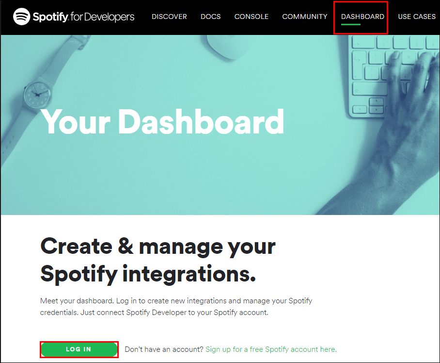

# Data-Engineering 06 - Spotify API

## Spotify App 생성 및 토큰 발급
> Spotify의 Web API를 사용하기 위한 토큰 발급이 필요

### General Guide
- [Spotify General Guide](https://developer.spotify.com/documentation/general/guides/authorization-guide/)에 들어가서 하단부에 보면 'Client Credentials Flow' 라고 있음
    - 우리가 API를 사용하는 흐름을 보여줌

  
  - 우리가 Apotify Accounts Service에 필요 정보 보내기
  - Spotify으로부터 access token 제공 받음
  - 제공 받은 access token을 Spotify Web API에 보내기
  - Json 객체로 정보를 보내줌

  
  - 한 번 보낸 access token의 유효기간이 3600초 = 1시간 임
  - 다시 사용하기 위해선 한시간 뒤에 또다시 access token을 받는 과정 진행해야 함

### App 생성하기
> Client와 API가 서로 어떻게 작용하는지 전체를 관장하는 곳
- 페이지 상단의 Dashboard 들어가서 로그인, App 생성하기

  
  
  
  - 앱 생성 완료!

---

## Python 기본문법
> Spotify API를 사용하기 위한 Python 기본에 대해 알아보겠음

### Python 스크립트 저장을 위한 폴더 만들어주기
- 터미널을 열고(굳이 터미널에서 할 필요는 없음) 앞으로 작성할 Python 스크립트를 저장할 폴더 생성해주기
- 'Spotify' 라는 폴더에 'spotify_api.py' 파일 생성해줌

  

- 코드설명

  ```python
  # 필요 패키지 임포트
  import sys

  # 이 스크립트가 작동할때 실행되는 main 함수
  def main():
      print('Spotify')

  # 만약 name 이 main 이면, main() 함수를 실행시켜라
  if __name__ == '__main__':
      main()

  ```

## Python Requests 패키지
> API 사용에 필요한 python 라이브러리인 Requests 패키지에 대해 알아보겠음

### Requests 설치
- [Requests](https://requests.readthedocs.io/en/master/) 페이지에서 기본 설명 확인 가능

  

- 페이지 제일 하단부의 'Developer Interface'에 들어가면 우리가 사용할 패키지에 대한 기본 설명있음

  

  - 앞으로 자주 사용할 기능들에 대한 설명이 있음

  

- 터미널에서 'pip install requests' 명령어로 requests 설치

## API를 통해 데이터 요청
> Spotify의 Search API를 통해 가수,곡 등의 정보들에 대해 검색을 해볼것임

### Search API
- [Spotify Search API](https://developer.spotify.com/documentation/web-api/reference/search/search/)에 접속하면 (Spotify의 Web API의 Reference에 들어가면 있음), Search API에 대한 기본 설명이 있음
