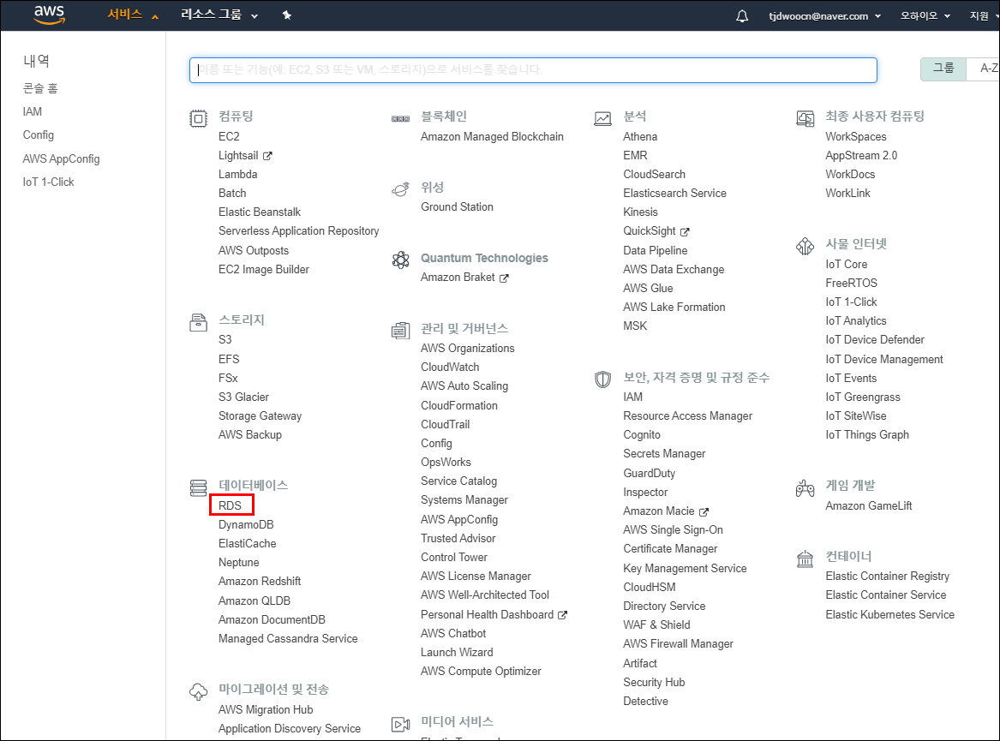
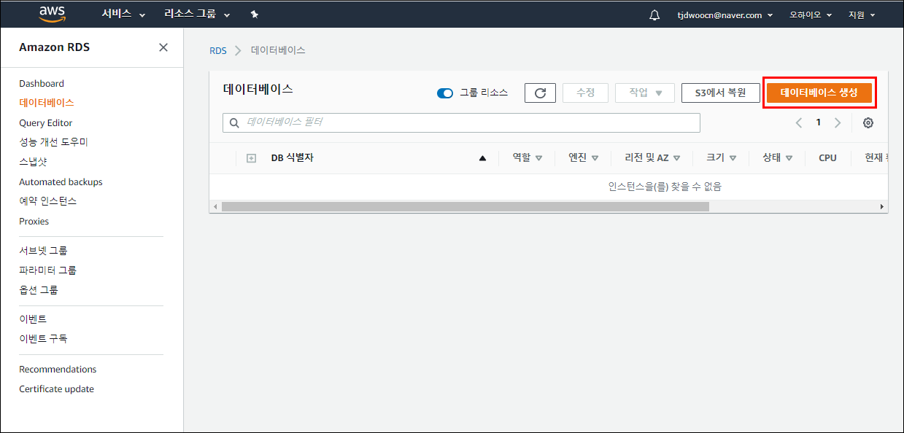
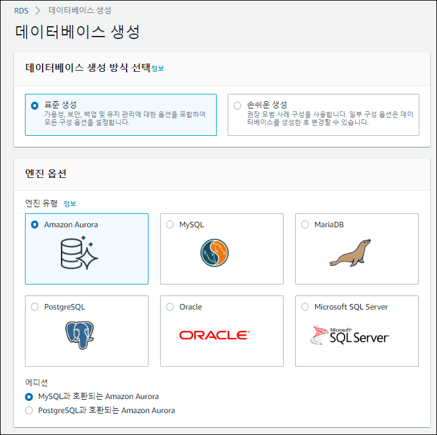
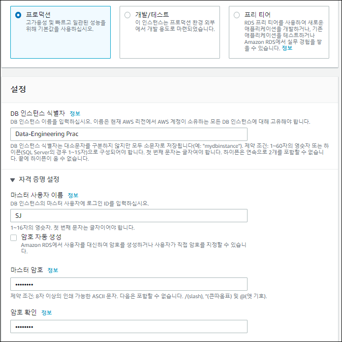
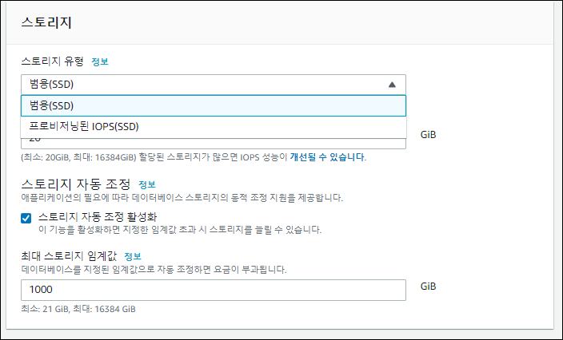
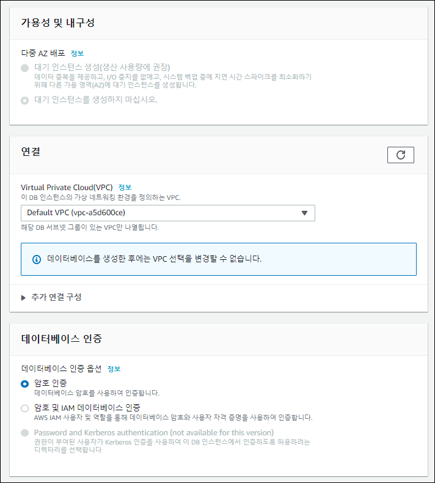
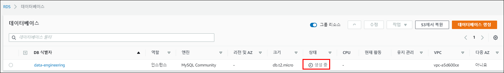

# Data-Engineering 07 - Data, RDBMS

## AWS 클라우드 MySQL
> AWS 안에서 RDBMS를 만들어 보겠음

> Free-Tier 사용

### RDS
- [AWS](https://us-east-2.console.aws.amazon.com/console/home?region=us-east-2#) 페이지에서 서비스 부분을 보면 데이터베이스 부분에 RDS를 확인할 수 있음

    

### Database 생성
1. 데이터베이스 탭에서 데이터베이스 생성
2. 데이터베이스 종류 선택 가능
3. 우리는 MySQL의 5.7.22 버전으로 진행 (가장 stable 한 버전이라고 함)
4. Templates 에서 우리는 Free tier 선택
5. DB instance identifier에서 간단히 로그인 아이디와 비번 설정
6. 인스턴스 사이즈 설정: 프리티어용 기본
7. 스토리지: General, 주로 저장용 사용 | 프로비저닝된 IOPS: 데이터의 주고 받음이 얼마나 빠르게 할 수 있느냐에 중점
8. 스토리지 Auto Scaling: 따로 확장에 대한 작업 없이 AWS RDS 자체적으로 관리하여 확장이 필요할때 확장시켜줌
9. Multi-AZ Deployment: 한국에서 DB 쓸때와 미국에서 쓸때의 차이가 없도록 하게 해줌 (free tier 는 사용불가)
10. VPC: 가상환경 구축, 해당 VPC로만 접근 가능 (Security 관련)
11. DB 생성완료 (생성 직후에는 status에 생성중이라고 뜨고 잠시 후 사용가능이라고 뜰것임)

    
    
    
    
    
    
