# Data-Engineering 07 - Data, RDBMS

## AWS 클라우드 MySQL
> AWS 안에서 RDBMS를 만들어 보겠음

> Free-Tier 사용

### RDS
- [AWS](https://us-east-2.console.aws.amazon.com/console/home?region=us-east-2#) 페이지에서 서비스 부분을 보면 데이터베이스 부분에 RDS를 확인할 수 있음

    

### Database 생성
1. 데이터베이스 탭에서 데이터베이스 생성
2. 데이터베이스 종류 선택 가능
3. 우리는 MySQL의 5.7.22 버전으로 진행 (가장 stable 한 버전이라고 함)
4. Templates 에서 우리는 Free tier 선택
5. DB instance identifier에서 간단히 로그인 아이디와 비번 설정
6. 인스턴스 사이즈 설정: 프리티어용 기본
7. 스토리지: General, 주로 저장용 사용 | 프로비저닝된 IOPS: 데이터의 주고 받음이 얼마나 빠르게 할 수 있느냐에 중점
8. 스토리지 Auto Scaling: 따로 확장에 대한 작업 없이 AWS RDS 자체적으로 관리하여 확장이 필요할때 확장시켜줌
9. Multi-AZ Deployment: 한국에서 DB 쓸때와 미국에서 쓸때의 차이가 없도록 하게 해줌 (free tier 는 사용불가)
10. VPC: 가상환경 구축, 해당 VPC로만 접근 가능 (Security 관련)
11. DB 생성완료 (생성 직후에는 status에 생성중이라고 뜨고 잠시 후 사용가능이라고 뜰것임)

    
    
    
    
    
    

---

## RDBMS - MySQL WorkBench로 접속
> 위에서 만든 데이터베이스를 MySQL 워크벤치를 통해서 연결해보겠음

### 데이터베이스 연결
- 우선 기존에 만든 MySQL DB의 퍼블릭 엑세스 가능성이 Yes로 되야함

    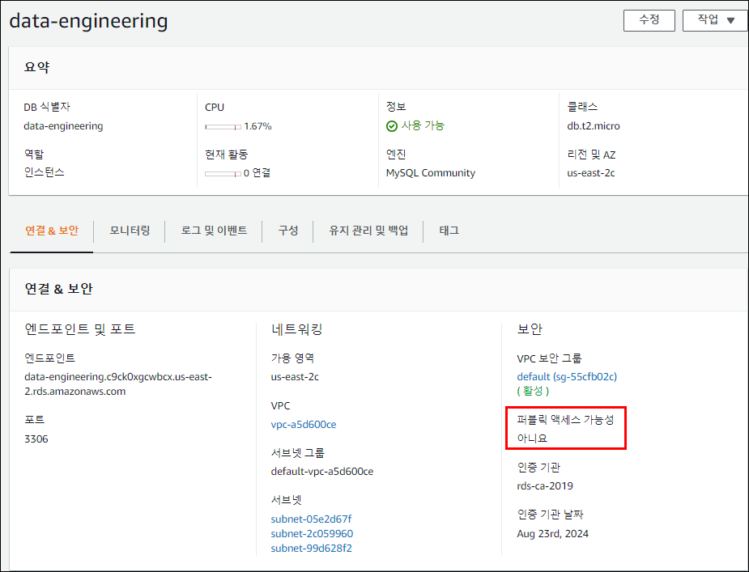
  
- 수정을 눌러 정보변경창으로 들어간 뒤 네트워크 및 보안으로 가서 Yes로 수정
  
    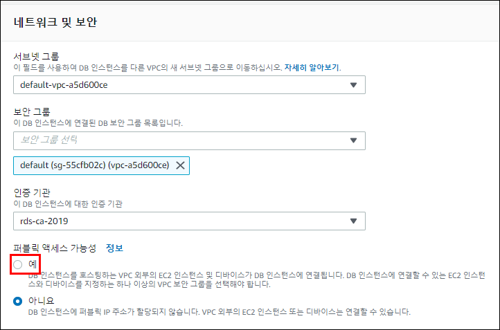

- 보안정보 추가해주기(VPC security groups)
  
    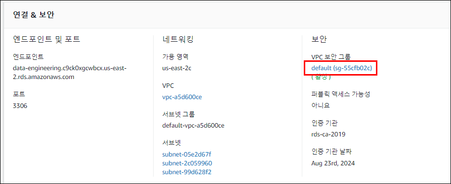
    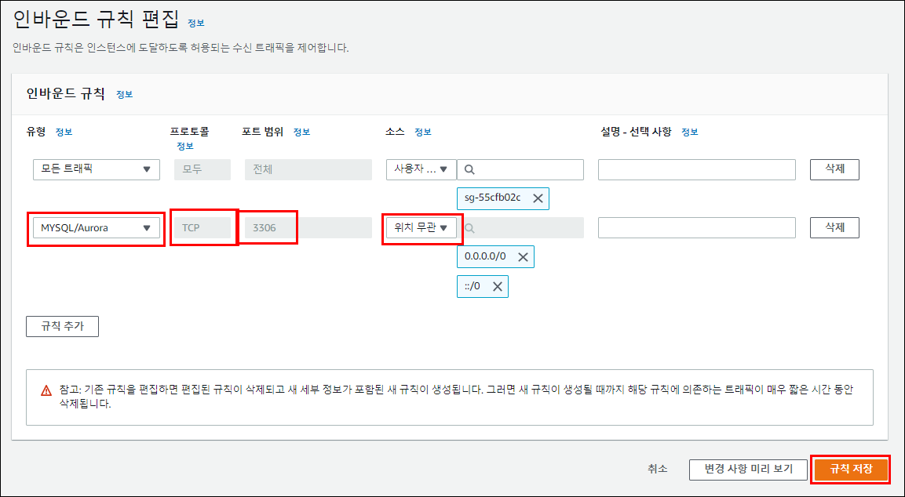
    - 인바운드 규칙 추가, 어떤 프로토콜을 통해 DB에 접근할떄 허용할것이냐
  
- [MySQL WorkBench](https://www.mysql.com/products/workbench/)에 접속하여 Community 버전 설치

    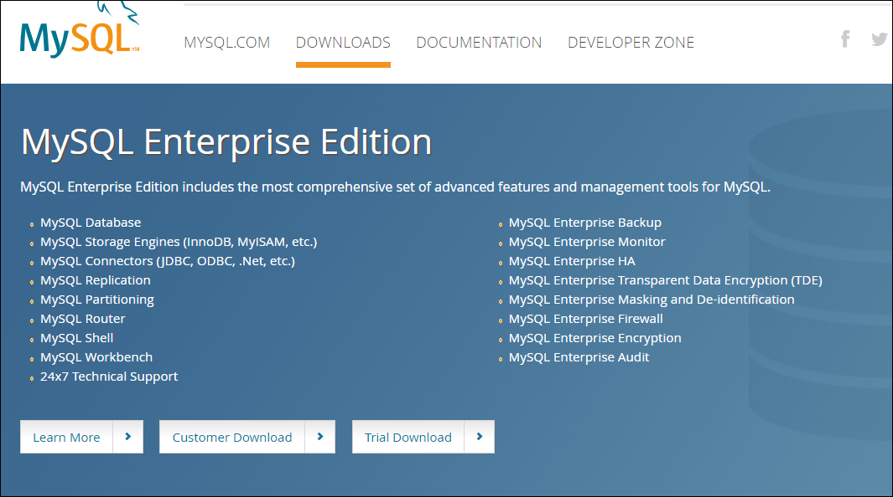

- AWS로 설치한 MySQL 서버 정보 입력 후 접속
    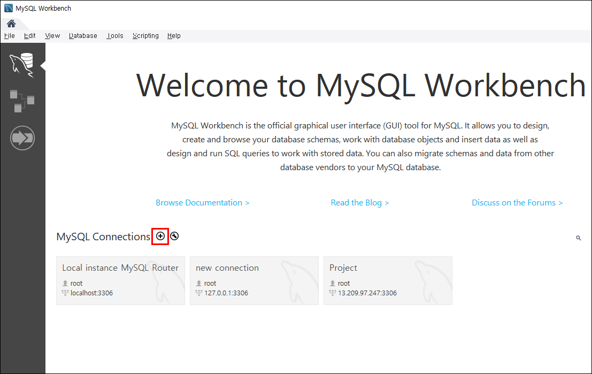
    - 플러스를 눌러 새로운 DB서버 추가해주기 

    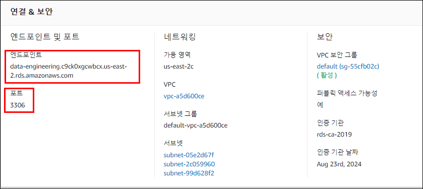
    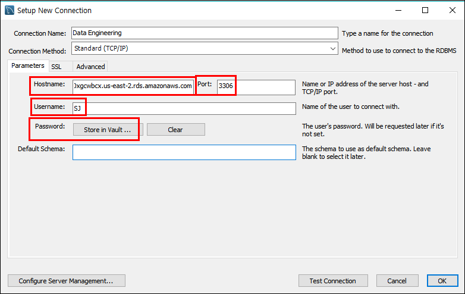
    - Hostname에는 endpoint 정보 입력, port 정보도 입력
    - Username, Password 에는 본인 정보 입력
    - Default Schema는 블랭크로 남겨둬도 됨
   
    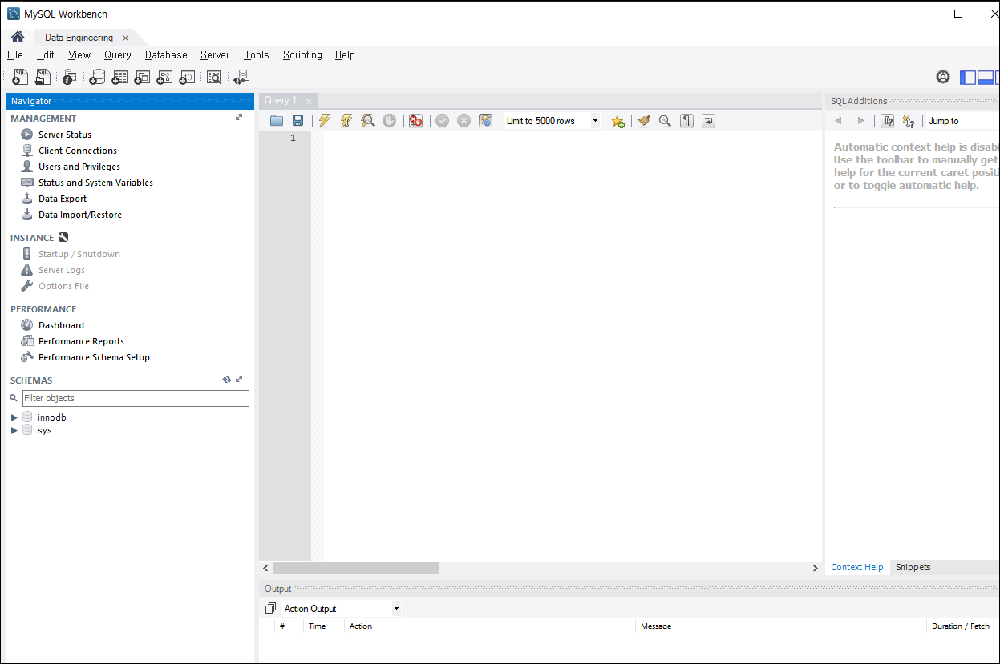
    - 접속 완료!

### 새 스키마, 테이블 생성
- DB에 접속 했으면 DB의 새로운 스키마를 생성해줘야 함
  
    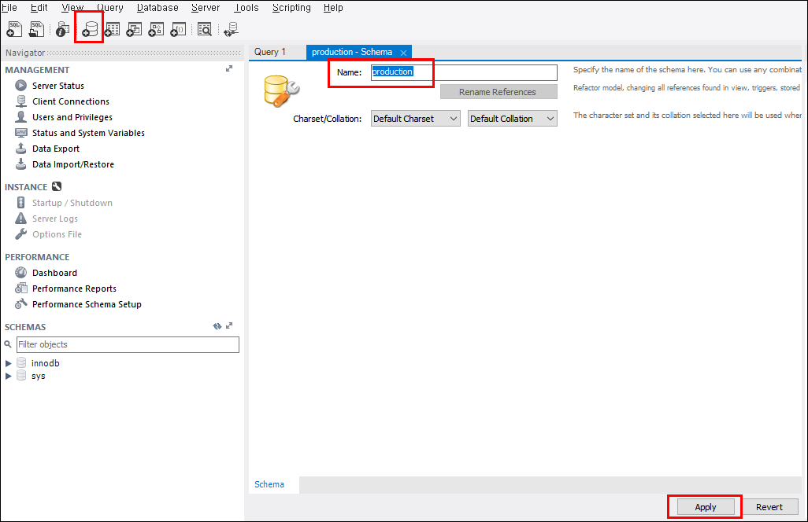
    - 왼쪽 상단의 'creates new schema' 버튼을 눌러 생성하기
    - 스키마의 이름은 임의로 'production' 이라고 정함
    - 아래 'Apply' 버튼 클릭, 쭉쭉 누르다 'Finish'

    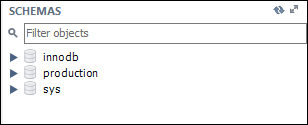
    - 스키마 생성완료

    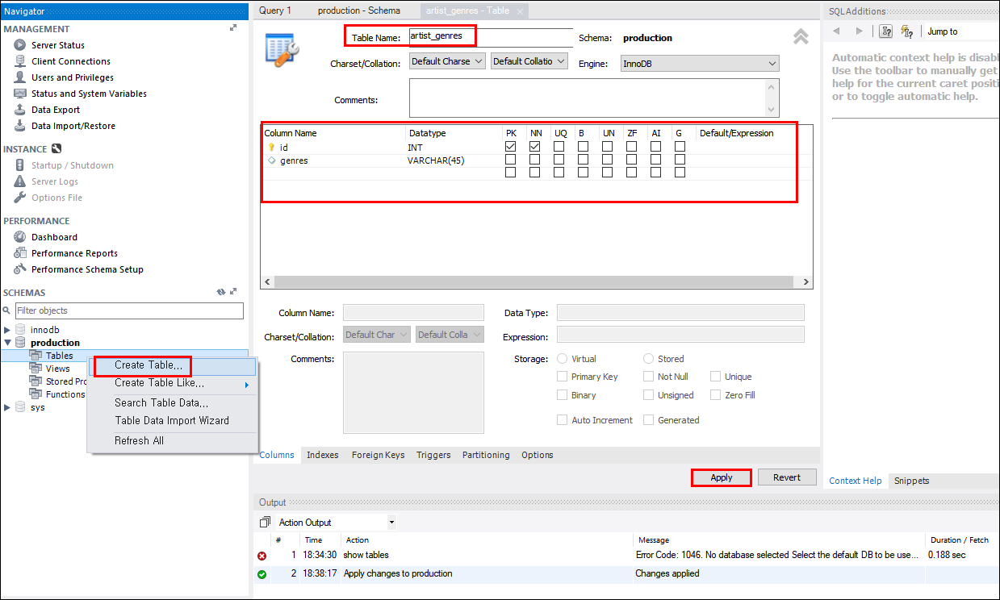
    - 스키마 더블 클릭 후 Table 탭이 보이면 우클릭하여 'Create Table' 클릭
    - Table Name 입력 ('artist genres'라고 정함), table 컬럼들 입력 후 Apply
  
    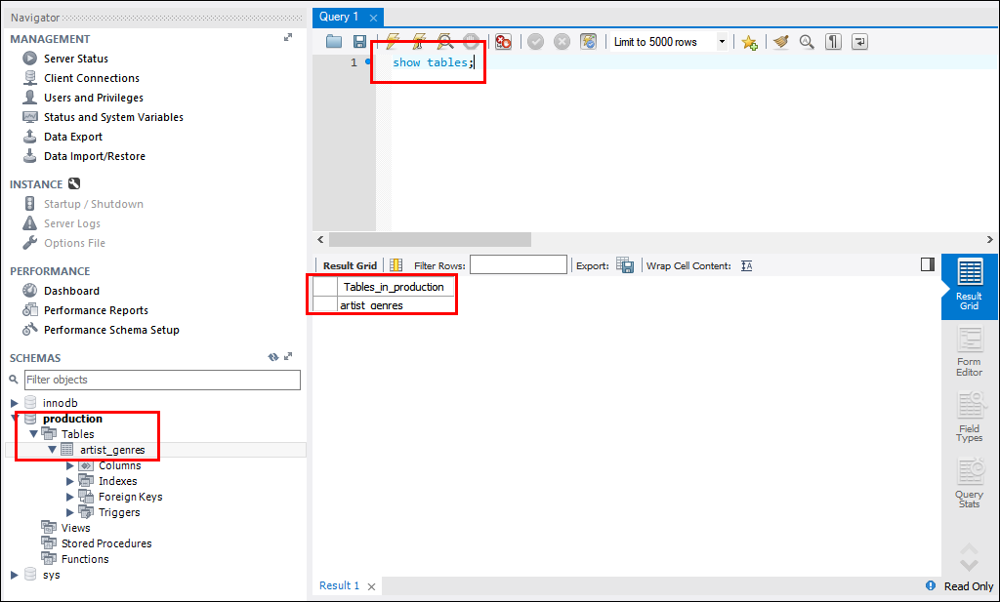
    - 테이블 생성 완료
    - 쿼리문으로 'show tables;' 입력후 ctrl + enter 하면 방금 만든 테이블이 검색됨!

    
