# Data-Engineering 07 - Data, RDBMS, ERD

## Data Types
> Schema에서 저장되는/쓰이는 각 데이터별로 타입의 종류가 다르고, 타입별로 사용방법 또한 다르다

### SQL Data Types

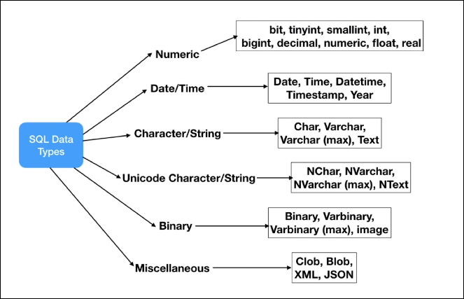

- Numeric Data

    

- Date and Time Data

    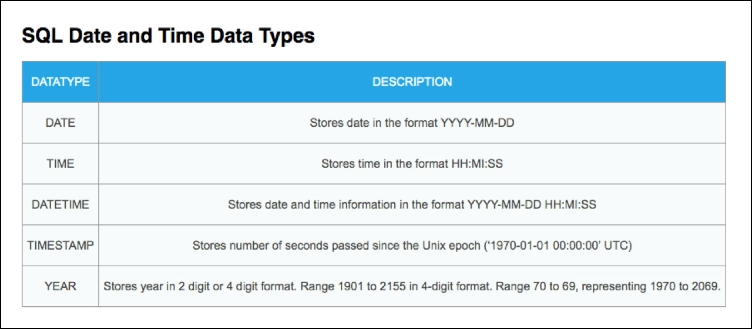
    - unix time -> 한국은 KST

- Character and String Data

    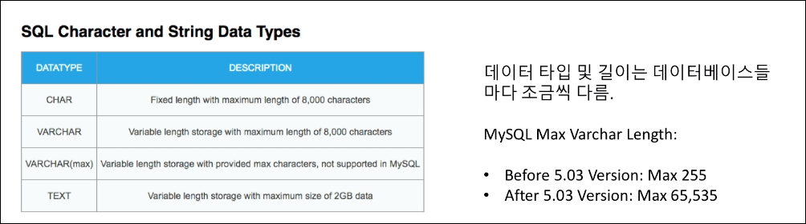
    - string의 경우 간단하게 최대 용량만큼 받아들일 수 있게 셋팅 할수도 있지만,
    - resource를 효율적으로 쓰기 위해서는 딱 필요한 범위 만큼으로만 지정 해두는것이 좋음
    - 한국인의 이름 Char 경우 10글자 이상 나오는 경우는 정말 드뭄

---

## Relational Database
> 관계형 데이터베이스, 현재 가장 많이 쓰이고 있는 데이터 베이스 형식 중 하나

### Database
- 데이터를 가지고 있는, 정리되어 있는 데이터들의 컬렉션
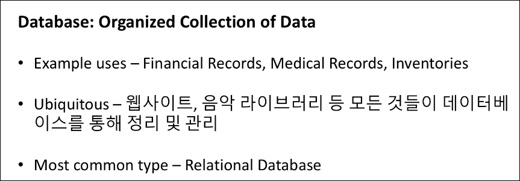

### 관계형 데이터 모델의 데이터베이스, RDB
- 데이터를 표현하는 모델, 2차원의 테이블 형태로

### 속성 및 특징

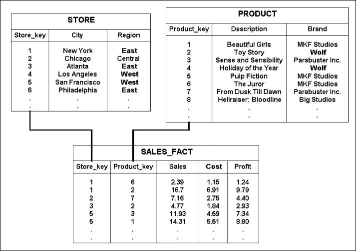
- 각 테이블 안의 데이터들이 서로 관계/연결고리를 가지고 있음

### RDB
- Normalization(Reduce Redundancy): 복수의 데이터가 들어가는 것을 최대한 방지, 데이터 테크닉
    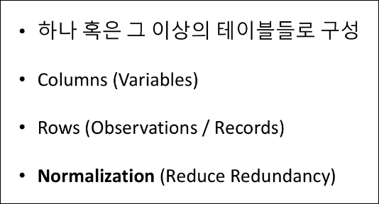
    
- 정규화 전/후
  
    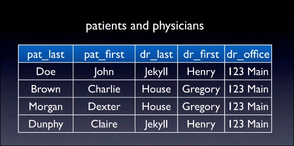
    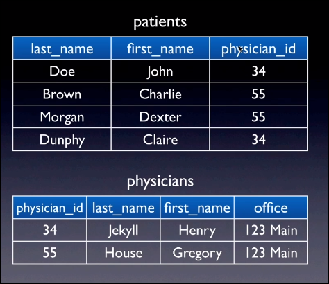

### 종류
- 전체적으로 비슷한 특성을 가지고 있지만
- 각 데이터베이스 별로 서로의 장/단점이 다름
  
    

---

## ERD (Entity Relationship Diagram)
> 데이터 모델링 설계 과정에서 사용하는 모델로 약속된 기호를 이용하여 데이터베이스의 구조를 쉽게 이해

### ERD의 기본 요소들
- Entities, Attributes, Relationships
  
    

- Patients and Physicians
  
    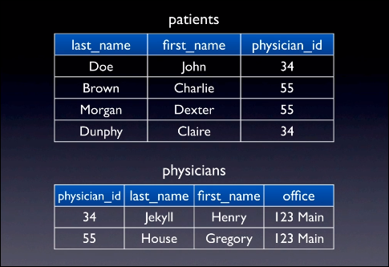
    - 환자와 의사 모두 환자id를 가지며 '관계'를 가지게 됨

- Symbols and Notations
  
    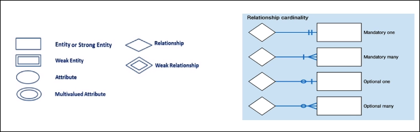
    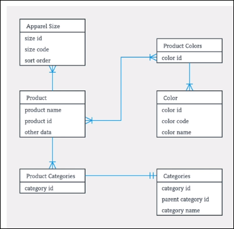
    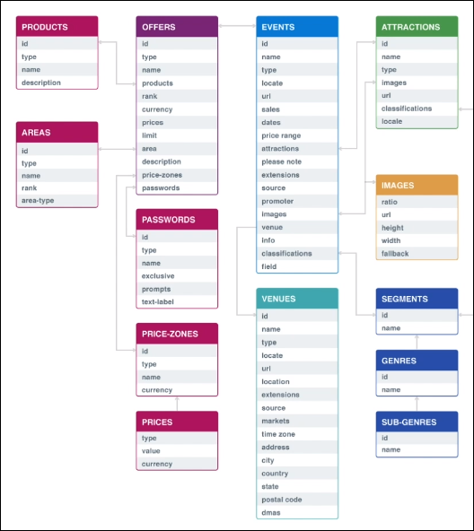
    - 티켓마스터의 model 예시

---

## Primary Key & Uinque Key

### Primary key
- 테이블에 하나밖에 없는 유니크한 구별 값, 없어선 안되는 값

    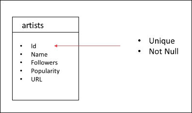

- Foreign Key, 는 다른 테이블의 키 값
  
    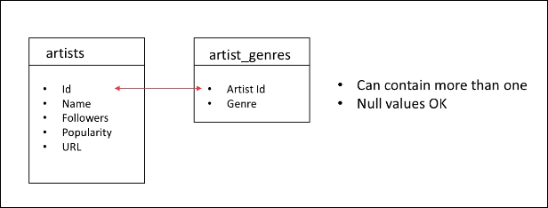
    - 다른 테이블과의 relation을 나타냄
    
### Unique Key
- 또 다른 인덱싱 키, 둘다 유니크 하긴 함(중복 없음)
- 하나의 NULL value를 가질 수 있음
- 프라이머리 키가 아닌 유니크 한 값
- 하나 이상의 unique key, combination 가능 (이름 + 핸드폰번호)
  
    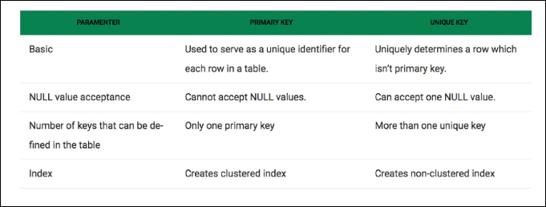

    
    
