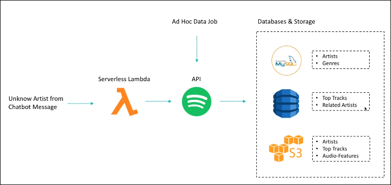
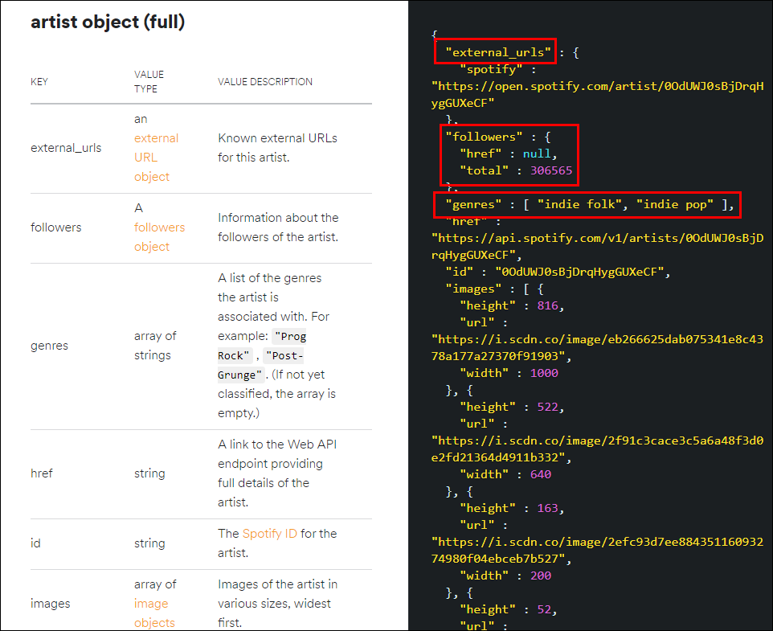
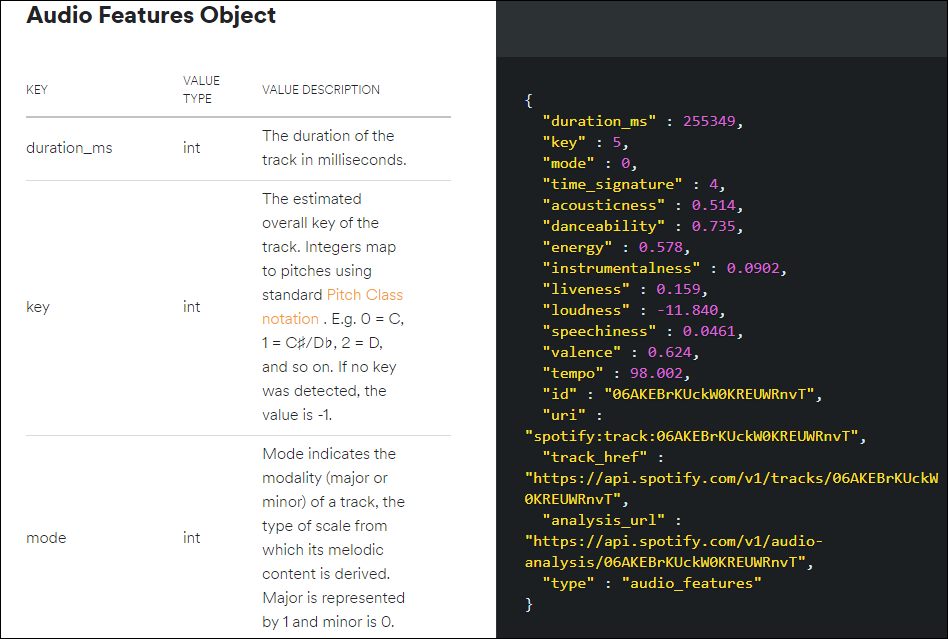
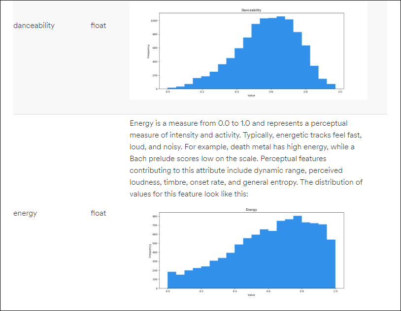
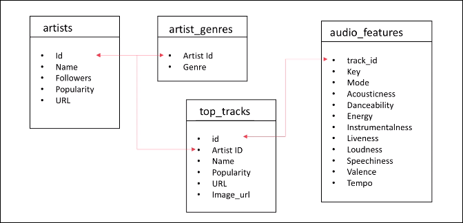

# Data-Engineering 08 - Spotify Data, Modeling

## Spotify Data
> 우리가 사용할 Spotify Data에 대해 좀 더 자세히 알아보겠음

- 아티스트 관련 데이터 수집 프로세스
  
    

### Get Artist API
- [Spotify Get Artist API](https://developer.spotify.com/documentation/web-api/reference/artists/get-artist/) 페이지 오른쪽에 JSON으로 된 예시가 있는데
- Spotify에서 API로 데이터를 제공해줄때 어떠한 형식으로 제공해주는지 자세히 확인 가능
- 이 부분을 잘 파악하고 넘어가야 추후에 DB 모델링시 좀 더 효율적으로 모델링을 할 수 있음

    

### Tracks API - Audio Features Object
- 해당 노래에 대해 스포티파이가 노래들의 박자의 속도, 에너지가 넘치는지 등에 대해 수치화 해놓은 것

    
    
    - 재생시간은 얼만지, 키는 얼마나 높은지, 댄서빌리티, 에너지 등등 수치로 표시해놓음
    - 해당 features 별로 어떠한 분포를 보이고 있는지 표시되어 있음 (API Reference)

---

## Modeling
> 우리가 사용할 Spotify 데이터에 대해 어떤식으로 RDBMS를 구축할 수 있는지에 대해 알아보겠음

### 아티스트, 장르, 앨범, 탑 트랙, 오디오 피쳐 등
- 데이터 모델링 부분은 사실 구성을 어떻게 하느냐, 추후 활용을 어떻게 하느냐에 따라 테이블 구조가 달라질 수 있음
- 처음부터 '정규화'라는 과정을 거쳐서 아무 문제가 없는 모델링을 하면 좋겠지만 처음부터 그렇게 하기는 쉽지 않음 (어떠한 데이터가 어떻게 들어오는지, 사용되는지 파악하기 힘듬)
- 초기 구성은 아래 사진과 같이 구성예정
  
    
