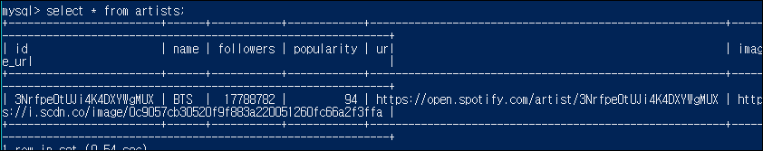
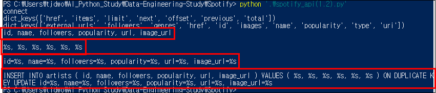
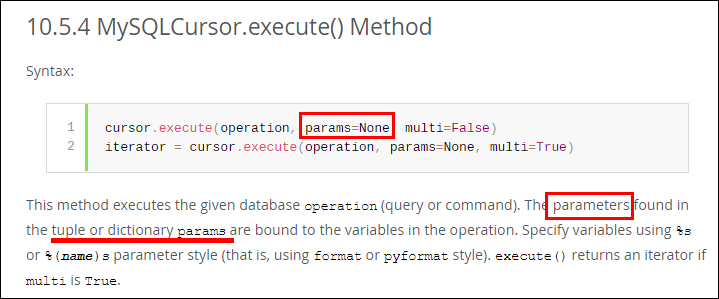
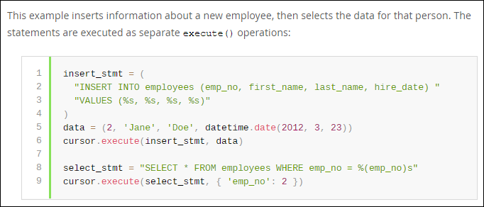

# Data-Engineering 09 - Python and MySQL (2)

## 파이썬에서 % 와 .format
>  string formatter

> 어떤식으로 데이터를 불러올건데, id, genre, followers 등에 대해 일일이 알지 못 함

> API로 새로운 데이터를 받아오면 해당 내용으로 새롭게 업데이트 해주기 위해 사용

### % 사용
    ```python
        # 쿼리 입력, % 사용
        query = "INSERT INTO artist_genres (artist_id, genre) VALUES ('%s', '%s')" % ('2345', 'hip-hop')
        cursor.execute(query)
        conn.commit()
    ```


---

### .format 사용
    ```python
        artostid = ~
        genre = ~    
        # 쿼리 입력, {} .foramt 사용
        query = "INSERT INTO artist_genres (artist_id, genre) VALUES ('{}', '{}')".format(artist_id, genre)
    ```
- {} 안에는 다양한 포지션 값이 들어갈 수 있음
- ('{1}', '{0}')".format(artist_id, genre) 이렇게 되어 있으면,
  - 1에는 genre가 들어가고 0에는 artist_id가 들어감

---

## Python Dictionary와 JSON
> 데이터가 저장되는 form

### Dictionary
- 키 (id, genre)와 값(1234, rock)으로 구성됨
  ```python
  {'id': '1234', 'genre': 'rock'}
  ```
- Web API에서 데이터가 제공될때 dictionary 형식으로 제공됨
  - 그런데 막상 데이터를 받아보면 string 타입으로 전달됨
  - r.text['artists'] 로 검색을 하면...
  
    
    - type error 발생 --> 딕셔너리로 변환해야 함 --> JSON !!!

### JSON
- 딕셔너리 형태려 변환!
    ```python
        r = requests.get("https://api.spotify.com/v1/search", params = params, headers=headers)

        # string으로 들어오는 데이터를 딕셔너리로 변환해줌
        raw = json.loads(r.text)

        print(raw['artists'])
        # artists의 키값들 출력
        print(raw['artists'].keys())
    ```

    


---

## Duplicate Record 핸들링
> INSERT INTO 구문 사용시 에러가 자주나는, Duplicate 부분에 대한 처리법에 대해 좀 더 알아보겠음

### Search
- 일단 artists search API로 검색을 해보겠음

    ```python
        r = requests.get("https://api.spotify.com/v1/search", params = params, headers=headers)
        raw = json.loads(r.text)
        print(raw['artists'].keys())
        # items 내부의 키값들 출력
        print(raw['artists']['items'][0].keys())
    ```
    

- Query & Save them on DB

    ```python
        artist_raw = raw['artists']['items'][0]

        # 가수의 정보가 BTS가 맞는지 일단 확인
        if artist_raw['name'] == params['q']:
            artist = {
                    'id': artist_raw['id'],
                    'name': artist_raw['name'],
                    'followers': artist_raw['followers']['total'],
                    'popularity': artist_raw['popularity'],
                    'url': artist_raw['external_urls']['spotify'],
                    'image_url': artist_raw['images'][0]['url'],
            }

            # 쿼리문 작성, 중복될시 대비
            query = """
                INSERT INTO artists (id, name, followers, popularity, url, image_url) 
                VALUES ('{}', '{}', {}, {}, '{}', '{}')
                ON DUPLICATE KEY UPDATE id='{}', name='{}', followers={}, polularity={}, url='{}', image_url='{}'
            """.format(
                artist['id'], 
                artist['name'], 
                artist['followers'], 
                artist['popularity'], 
                artist['url'],
                artist['image_url'],
                artist['id'],  # 중복 확인을 위해 한번더 
                artist['name'], 
                artist['followers'], 
                artist['popularity'], 
                artist['url'],
                artist['image_url'],
                )
        # 쿼리내용 확인
        print(query)
        # 쿼리 실행 및 커밋
        cursor.execute(query)
        conn.commit()
    ```
    
    
    
    - 쿼리문 확인, DB 입력 확인

- 해당 쿼리를 계속해서 날리더라도 중복때문에 문제 생기지 않고,
  - 중복된 값은 그대로 두고 변화된 값으로만 계속 업데이트 시킬것임

---
### 쿼리 줄이기
- 위에서 짠 코드는...너무 길었음, 반복적인게 너무 많아 최대한 줄여보려고 함

    ```python
        def insert_row(cursor, data, table):

            columns = ', '.join(data.keys())
            print(columns)
            print()
            placeholders = ', '.join(['%s'] * len(data))
            print(placeholders)
            print()
            key_placeholders = ', '.join(['{0}=%s'.format(k) for k in data.keys()])
            print(key_placeholders)
            print()
            sql = "INSERT INTO %s ( %s ) VALUES ( %s ) ON DUPLICATE KEY UPDATE %s" % (table, columns, placeholders, key_placeholders)
            print(sql)
            sys.exit(0)

        insert_row(cursor, artist, 'artists')
        sys.exit(0)
    ```

    
    - insert_row 함수 실행결과
    - artist 테이블(update 해준)의 key값들 먼저 나오고
    - VALUES에 넣어줄 %s 6개 나오고
    - DUPLICATE KEY UPDATE 뒤에 넣어줄 id=%s ~~ 등 나오고
    - 실제 쿼리문 출력됨
  
- %s 부분을 채워줘야함! (기존 코드의 sql 변수 생성 밑에 추가)
    ```python
        sql = "INSERT INTO %s ( %s ) VALUES ( %s ) ON DUPLICATE KEY UPDATE %s" % (table, columns, placeholders, key_placeholders)
        # data.values 를 하면 key값 제외하고 값들만 나옴
        cursor.execute(sql, list(data.values())*2) 
        # 리스트가 ['id값', '아티스트이름'~~] 식으로 만들어짐
        # 이런 리스트를 *2 하여 두번쨰 %s 부분도 채워줌
    ```

- conn.commit() 으로 정상작동 되는지 확인하면 끝!!

---

- cursor.execute() 추가 설명
  
    
    


  


    