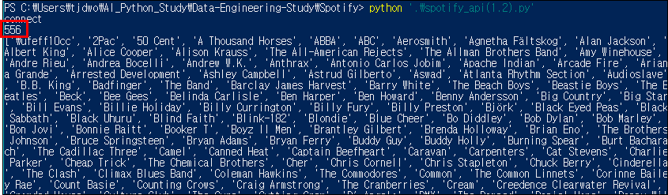
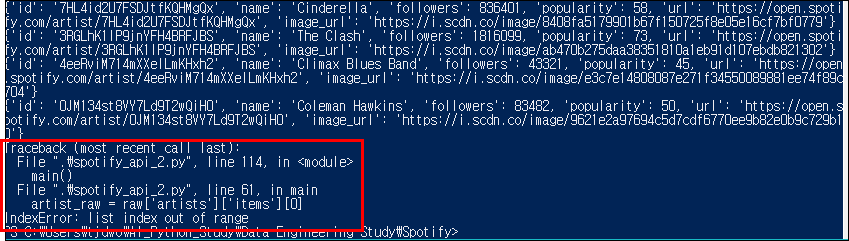
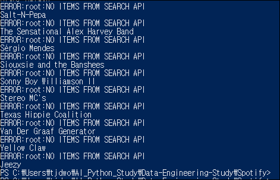
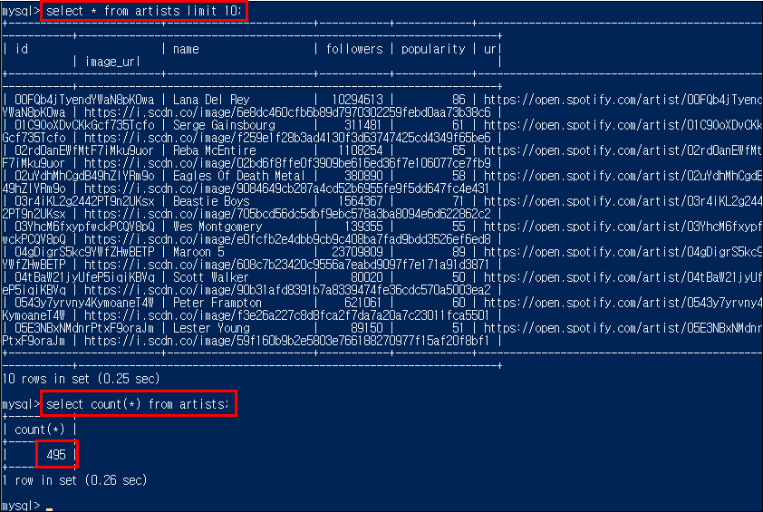

# Data-Engineering 09 - Python and MySQL

## Artists List
> 이전까진 한 가수(BTS)의 데이터만 받아 왔다면 이번에는 약 500팀의 데이터를 받아와 보겠음

### Artists List 불러오기
- 아티스트들의 이름만 넣어둔 csv 파일 생성
- 해당 csv 파일 불러오기
  
    ```python
        # 불러온 아티스트 이름 넣어줄 빈 리스트 생성
        artists = []
        # with open 구문으로 csv 파일 불러오기, 
        # 불러와서 필요한 내용만 뽑은 뒤 자원정리 위해 with open 구문 사용
        with open('../artist_list.csv', encoding='utf8') as f:
            raw = csv.reader(f)
            for row in raw:
                artists.append(row[0])
        # 총 556팀
        print(len(artists))
        print(artists)
        sys.exit(0)
    ```
    
    

---

### 불러온 아티스트들의 데이터 DB에 넣어주기
- 위에서 불러온 아티스트들의 정보를 Search API로 가져와 우리의 DB에 넣어주겠음

    ```python
       # Spotify Search API
       # artists 리스트에 있는 각 아티스트 별로 loop 돌림
       # 이전에 만들었던 코드와 동일 (for 문만 추가)
        for a in artists:
            params = {
                "q": a,
                "type": "artist",
                "limit": "1", 
            }
        
            r = requests.get("https://api.spotify.com/v1/search", params = params, headers=headers)
            raw = json.loads(r.text)

            artist_raw = raw['artists']['items'][0]
            artist = {}
            if artist_raw['name'] == params['q']:
                artist.update(
                    {
                        'id': artist_raw['id'],
                        'name': artist_raw['name'],
                        'followers': artist_raw['followers']['total'],
                        'popularity': artist_raw['popularity'],
                        'url': artist_raw['external_urls']['spotify'],
                        'image_url': artist_raw['images'][0]['url'],
                    }
                )
                print(artist)
                insert_row(cursor, artist, 'artists')
        
        conn.commit()
        sys.exit(0)

    ```

    
    - 잘 돌아가다가 에러 발생!
    - 'list index out of range'!
    - raw['artists']['items'][0]에 아무 데이터가 없다는 뜻 같음

---

### 에러 핸들링 - 아티스트에 대한 정보가 없는경우!
- try except 문으로 예외 처리해주기
    ```python
        # 아티스트에 대한 정보가 없는 경우 대비
        # artist_raw에 데이터가 안들어 오는 경우가 있으니 이 부분에 try문 추가
        try: 
            artist_raw = raw['artists']['items'][0]
            if artist_raw['name'] == params['q']:
                artist.update(
                    {
                        'id': artist_raw['id'],
                        'name': artist_raw['name'],
                        'followers': artist_raw['followers']['total'],
                        'popularity': artist_raw['popularity'],
                        'url': artist_raw['external_urls']['spotify'],
                        'image_url': artist_raw['images'][0]['url'],
                    }
                )
            insert_row(cursor, artist, 'artists')

        except:
            # 에러 발생시 출력
            logging.error('NO ITEMS FROM SEARCH API')
            print(artist_raw['name'])
            # 에러 발생시 무시하고 그대로 진행(continue)
            continue
    ```

    
    
    - 에러발생 메세지 출력하면서 계속 진행
    - 총 556팀의 리스트중 495팀의 데이터 입력받음

---

## Batch 형식