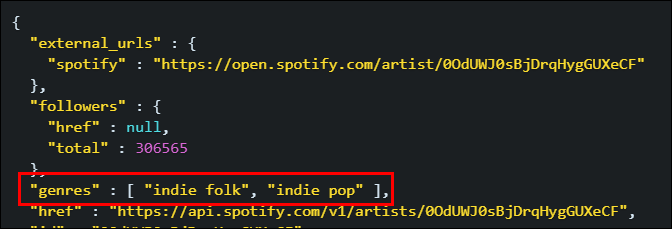
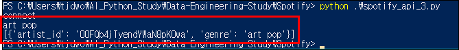
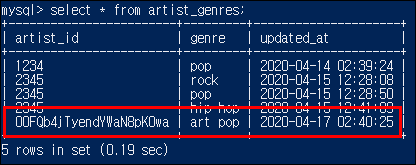

# Data-Engineering 09 - Python and MySQL (4)

## Artists Genres
> 이전에 가져온 50개씩 나눠진 ids의 장르들에 대한 정보도 가져와 artist_genres 테이블에 넣어보겠음

### Artists 리스트 안의 Artist_genres 리스트
> 1. artist_genres 라는 리스트를 만들기
> 2. artist_id 와 genre값을 딕셔너리 형태로 리스트에 넣어주기,
>       - 리스트에 모든 아티스트의 artist_id값과 genre값을(딕셔너리) 넣어줌
> 3. 하나 하나씩 insert_row 함수로 테이블에 넣어주기

- 아티스트 정보 안에 genres 가 리스트 형식으로 들어가 있음

    


- 'spotify_api_3.py' 

    ```python
        # 50개씩 묶기
        artist_batch = [artists[i: i+50] for i in range(0, len(artists), 50)]
        
        # genres 만 따로 넣어줄 리스트 생성
        artist_genres = []

        for i in artist_batch:
            # ids =  1234,2345,3456 이런식으로 , 로 붙이기 (string)
            ids = ','.join(i)
            URL = "https://api.spotify.com/v1/artists/?ids={}".format(ids)

            r= requests.get(URL, headers=headers)
            raw = json.loads(r.text)

            # 각 아티스트 접근
            for artist in raw['artists']:
                # 아티스트의 장르 찾기
                for genre in artist['genres']:
                    print(genre)
                    # artist_genres 리스트에 아티스트 아이디 정보와 장르 정보 같이 입력
                    artist_genres.append(
                        {
                            'artist_id': artist['id']
                            'genre': genre                    }
                    )
                    print(artist_genres)
                    logging.info('Good')
                    sys.exit(0)
    ```

    
    - artist_id와 genre가 하나의 리스트(artist_genres)에 들어가 있음
  
---

- 'artist_genres' 테이블에 장르 데이터 넣어주기

    ```python
        for i in artist_batch:
            # ids =  1234,2345,3456 이런식으로 , 로 붙이기 (string)
            ids = ','.join(i)
            URL = "https://api.spotify.com/v1/artists/?ids={}".format(ids)

            r= requests.get(URL, headers=headers)
            raw = json.loads(r.text)

            for artist in raw['artists']:
                for genre in artist['genres']:
                    artist_genres.append(
                        {
                            'artist_id': artist['id'],
                            'genre': genre                    }
                    )

        # artist_genres의 각 딕셔너리 값 별로
        for data in artist_genres:
            print(data)
            # artist_genres 테이블에 데이터 넣어주기
            insert_row(cursor, data, 'artist_genres')
            conn.commit()
            sys.exit(0)
    ```
    
    - 'artist_genres' 테이블에 잘 들어감!


