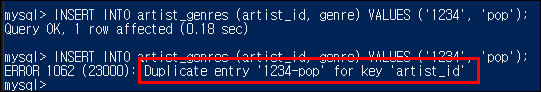

# Data-Engineering 09 - Python and MySQL

## PyMySQL
> 파이썬으로 MySQL 클라이언트에 접속하고 관리하기 위한 패키지

### 설치
- 커멘드 창에서 아래 명령어 입력
    ```linux
    pip3 install pymysql

    # 또는 

    python -m pip install PyMySQL
    ```

### 접속
- 파이썬 스크립트로 pymysql 임포트 후 접속하기
    ```python
        import sys
        import requests
        import base64  # 나의 client id 와 secret key 를 base64 형태로 인코딩해주는 패키지
        import json
        import logging
        import pymysql

        client_id = "ab567c2671e34f2ebf5e6acbcb6db44f"
        client_secret = "ef7ee3b5900c40048bc142e88f112562"

        # MySQL 접속할 때 사용한 본인 정보 입력
        host = 
        port = 
        username = 
        database = 
        password = 

        def main():
            # Connect시 접속오류가 많이 일어남
            # try-except문 사용
            try:
                # 접속
                conn = pymysql.connect(host, 
                                    user=username, 
                                    passwd=password, 
                                    db=database, 
                                    port=port, 
                                    use_unicode=True,  # 다양한 언어처리 위해
                                    charset='utf8')    # 유니코드 사용위해
                # cursor를 통해서 직접 DB에 쿼리를 날릴 수 있음
                cursor = conn.cursor()
            
            # 접속이 안되면 에러 알림
            except:
                logging.error('Could not connect to RDS')
                sys.exit(1)

            # 접속 성공하면 해당 쿼리 실행
            cursor.execute('SHOW TABLES')
            # 쿼리로 가져온 데이터를 모두 불러오겠다 라는 뜻
            cursor.fetchall()

            # 커넥션 성공하면 출력
            print('connect')
            sys.exit(0)

    ```
    
    - 성공!


### CLI (Command Line Interface) 로 접속하기
1. mysql이 설치된 경로로 이동 또는 환경변수에 path 추가
  - 'C:\Program Files\MySQL\MySQL Server 8.0\bin'
2. cmd, 커멘드, PowerShell 등 shell 창을 열어줌 (본인은 PowerShell 사용)
3. 명령어 입력
  - 'mysql --host=hostname --port=portnumber --user=username --password=password'
4. 접속완료!
   
    

---

## INSERT & UPDATE
> INSERT와 UPDATE 쿼리에 대해 알아보겠음

- 기존에 임시로 만들었던 테이블은 제거하고 다시 모델링에서 생각했던 모습으로 테이블 재생성
    ```linux
        CREATE TABLE artists (id VARCHAR(255), name VARCHAR(255), followers INTEGER, popularity INTEGER, url VARCHAR(255), image_url VARCHAR(255), PRIMARY KEY(id)) ENGINE=InnoDB DEFAULT CHARSET='utf8';
        
        CREATE TABLE artist_genres (artist_id VARCHAR(255), genre VARCHAR(255)) ENGINE=InnoDB DEFAULT CHARSET='utf8';
    ```
    
    - 생성된 것 확인
    - InnoDB 엔진이 가장 많이 쓰인다고 함
---

### INSERT
- 일단 artist_genres 테이블에 데이터 입력해보겠음

    

- Insert 구문 사용하여 데이터 입력
    ```linux
        INSERT INTO artist_genres (artist_id, genre) VALUES ('1234', 'pop');
    ```

    

- 하.지.만! artist_genres 테이블을 이상태로 나두면 똑같은 id, 장르 값이 들어올 수 있음(중복값이 들어와 저장 효율이 떨어짐)
    - 기존 테이블은 DROP TABLE 로 제거하고 (ALTER TABLE 로 수정해줘도 됨)
    - UNIQUIE KEY를 넣어준 새 artist_genres 테이블을 만들겠음
    ```linux
        CREATE TABLE artist_genres (artist_id VARCHAR(255), genre VARCHAR(255), UNIQUE KEY(artist_id, genre)) ENGINE=InnoDB DEFAULT CHARSET='utf8' ;
    ```
    
    - UNIQUE KEY 추가됨

- 다시 INSERT로 값을 넣으려는데, 이제는 중복되는 값을 넣으려니 에러 발생 (굿!)

    

- 이처럼 중복값이 들어왔을때 에러가 뜨는것은 좋음!
  
- 그러나 파이썬 스크립트가 작동중일때 이처럼 중복값이 들어와 에러가 뜨고 스크립트가 멈추면? 안됨!
  - 예외처리 필요

---

### UPDATE
- 일단 updated_at 이라는, 해당 로우가 언제 업데이트 됬는지 알려주는 새컬럼을 하나 추가 해줌
    ```linux
        ALTER TABLE artist_genres ADD COLUMN updated_at TIMESTAMP DEFAULT CURRENT_TIMESTAMP ON UPDATE CURRENT_TIMESTAMP;
    ```
    
    - 시간은 MySQL 자체의 Current Timestamp 사용
 
- 우리가 해당 로우의 키값/ID 값을 알고있을 때, 추가되는 값이 있을때 해당 로우값을 UPDATE해 줌
    ```linux
    UPDATE artist_genres SET genre='pop' WHERE artist_id='1234;
    ```
    
    - 위와 같이 UPDATE SET을 사용하고, 키 값을 알고 있어야 함
    - 파이썬으로 해당 부분을 처리하려면 여러 과정이 필요,,,하드코딩,,불편

### REPLACE
 - 아래와 같은 테이블이 있을때

    
    - REPLACE를 쓰면 비어있는 부분도 채워주고, 기존 데이터를 수정할때도 수정 가능
    - 그러나! 처리과정이 비 효율적임, 프라이머리키 AUTO_INCREMENT 사용시 문제
      - 기존 데이터를 덮어씌우는게 아니라 지웠다가 다시 채워넣는 방식임 (대용량 데이터 처리시 비효율)
      - 기존에 AUTO_INCREMENT로 생성된 ID=1 의 아티스트가 추후에 업데이트 될때 ID=1000 의 번호를 가지고 재생성 될 수 있음

  
### INSERT INTO ~ ON DUPLICATE 
- REPLACE와 다르게 지우는 과정 없음
- 어떠한 키값을 가지고 다양한 테이블 정보들을 (자주) 업데이트 해줘야 할 때 (artist의 popularity, follower 수치들은 지속적으로 변함)
- 수정 작업시 해당 명령어를 가장 많이 쓴다고 함

    ```linux
        INSERT INTO artist_genres (artist_id, country) VALUES ('1234', 'rock', 'FR') ON DUPLICATE KEY UPDATE artist_id='1234', genre='rock', country='FR';
    ```
