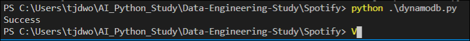
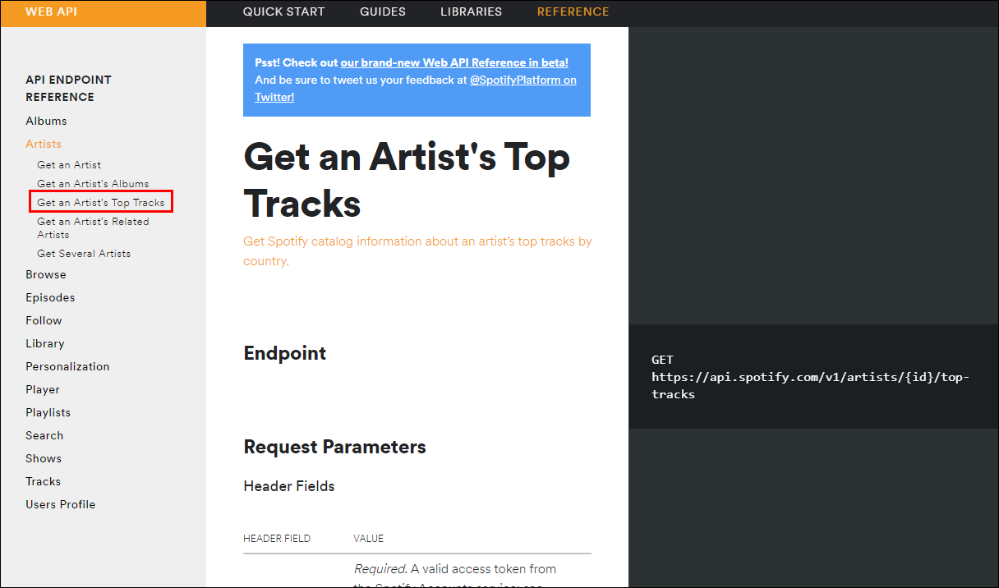
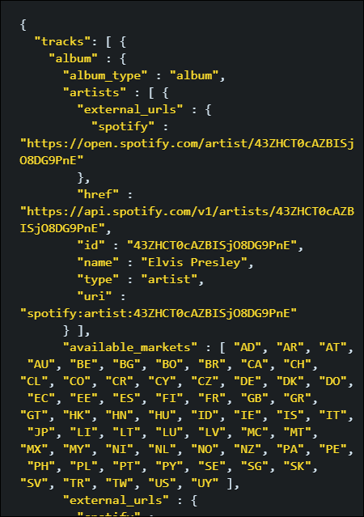
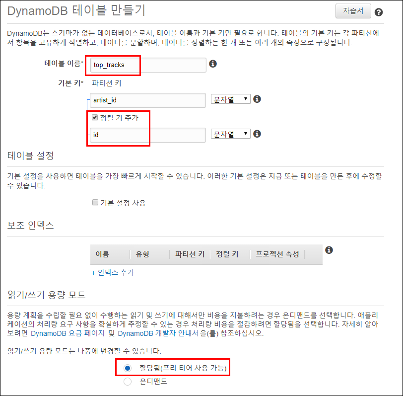
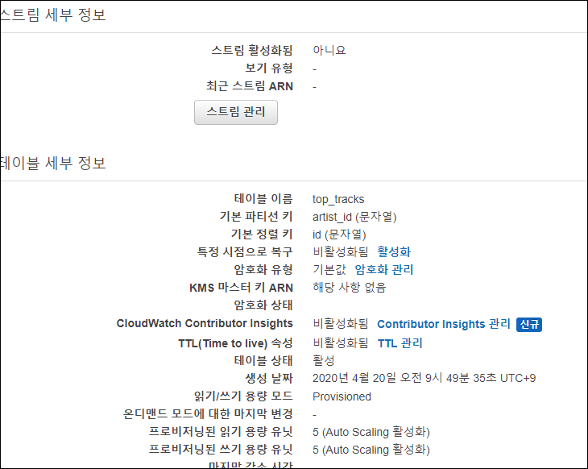

# Data-Engineering 10 - NoSQL (DynamoDB)(2)

## Boto3 Package
> AWS가 제공하는 Python SDK의 이름

### Boto3 설치 및 살펴보기
- Terminal 에서 아래 명령어 입력

    ```linux
    # 그냥 pip로 말고, 해당 경로에 설치하려면
    python -m pip install <library-name>
    ```
- [Boto3 Documentation](https://boto3.amazonaws.com/v1/documentation/api/latest/index.html) 접속하여 살펴보기

    

### boto3 사용하여 DynamoDB 접속
- 이전에 AWS cli 작업중 boto3 패키지 사용을 위한 기본 작업을 이미 끝냈음
    - 추후 가상서버 구성시에도 미리 진행해줘야 boto3 사용가능

- 'dynamodb.py' 생성
    ```python
    import os
    import sys
    import boto3

    def main():
        # dynamodb 접속
        try:
            dynamodb = boto3.resource('dynamodb', 
                                    region_name='ap-northeast-2', 
                                    endpoint_url='http://dynamodb.ap-northeast-2.amazonaws.com')
        except:
            logging.error('could not connect to dynamodb')
            sys.exit(1)
        
        print('Success')

    if __name__ == '__main__':
        main()
    ```

    
    - Success!

---

## DynamoDB 테이블 생성
> DynamodB에 TopTracks 데이터를 가져와 저장할 'top_tracks' 테이블을 만들어 보겠음

### TopTracks
- Spotify API에 보면 [TopTracks](https://developer.spotify.com/documentation/web-api/reference/artists/get-artists-top-tracks/) 데이터를 가져올 수 있는 API가 있음

    
    
    - artist_id를 path 파라미터 안에다 입력해줘야 함
    - tracks 안에 여러개의 딕셔너리가 존재

- top_tracks 테이블 
- 
    
    
    - 추후 데이터 확인에 좀 더 유용하게 하기 위해 sort_key를 추가해줬음
    - AutoScale이 가능한 Provisioned(프리티어) 사용
    - 생성완료

---

## DynamoDB - Partition, Global Index & Local Index
> 