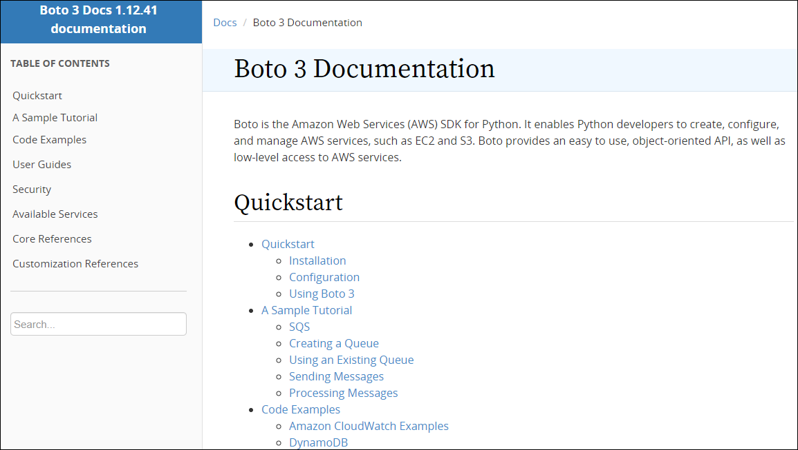
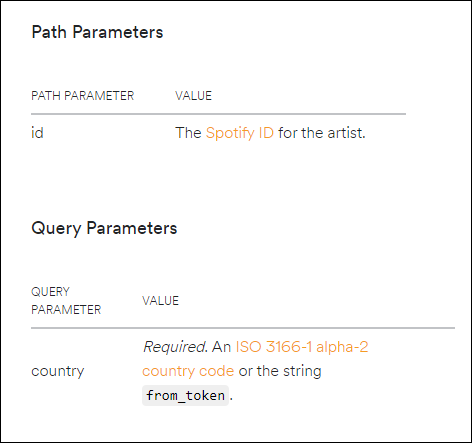

# Data-Engineering 10 - NoSQL (DynamoDB)(2)

## Boto3 Package
> AWS가 제공하는 Python SDK의 이름

### Boto3 설치 및 살펴보기
- Terminal 에서 아래 명령어 입력

    ```linux
    # 그냥 pip로 말고, 해당 경로에 설치하려면
    python -m pip install <library-name>
    ```
- [Boto3 Documentation](https://boto3.amazonaws.com/v1/documentation/api/latest/index.html) 접속하여 살펴보기

    

### boto3 사용하여 DynamoDB 접속
- 이전에 AWS cli 작업중 boto3 패키지 사용을 위한 기본 작업을 이미 끝냈음
    - 추후 가상서버 구성시에도 미리 진행해줘야 boto3 사용가능

- 'dynamodb.py' 생성
    ```python
    import os
    import sys
    import boto3

    def main():
        # dynamodb 접속
        try:
            dynamodb = boto3.resource('dynamodb', 
                                    region_name='ap-northeast-2', 
                                    endpoint_url='http://dynamodb.ap-northeast-2.amazonaws.com')
        except:
            logging.error('could not connect to dynamodb')
            sys.exit(1)
        
        print('Success')

    if __name__ == '__main__':
        main()
    ```

    
    - Success!

---

## DynamoDB 테이블 생성
> DynamodB에 TopTracks 데이터를 가져와 저장할 'top_tracks' 테이블을 만들어 보겠음

### TopTracks
- Spotify API에 보면 [TopTracks](https://developer.spotify.com/documentation/web-api/reference/artists/get-artists-top-tracks/) 데이터를 가져올 수 있는 API가 있음

    
    
    - artist_id를 path 파라미터 안에다 입력해줘야 함
    - tracks 안에 여러개의 딕셔너리가 존재

- top_tracks 테이블 
- 
    
    
    - 추후 데이터 확인에 좀 더 유용하게 하기 위해 sort_key를 추가해줬음
    - AutoScale이 가능한 Provisioned(프리티어) 사용
    - 생성완료

---

## DynamoDB - Partition, Global Index & Local Index
> 똑같은 데이터라면 DynamoDB(NoSQL)에서는 새로운 partition key(index)를 추가해줄 수 있음

### Partition key, Index
- 새로운 인덱스 생성을 통해서 또다른 키값을 추가할 수 있음

    
    
    - 'genre'라는 새로운 키값을 추가하면 artist_id와 genre 두개를 키로 해서 데이터 검색 가능
    - 이번에 여기서는 따로 새 인덱스를 추가하진 않을것임

---

## 데이터 Insert - Single, Batch, 
> Top Track 정보에 대해서 DynamoDB에 적재하는 과정을 진행해보겟음

### Insert Top Tracks data
- End Point는 이전에 확인했고, Path parameter와 Query Parameter 확인

    

- Artist_id 가 필요한데 이것은 이미 MySQL에 저장되어있음
- MySQL에서 데이터를 가져오기 위한 코드와 합치기
- DynamoDB에 top_tracks data 삽입
- put_item()이라는 싱글 데이터 삽입용 함수 사용

    

- 편의상 main() 함수만 가져옴
    ```python
        def main():
            try:
                dynamodb = boto3.resource('dynamodb', 
                                        region_name='ap-northeast-2', 
                                        endpoint_url='http://dynamodb.ap-northeast-2.amazonaws.com')
            except:
                logging.error('could not connect to dynamodb')
                sys.exit(1)
            
            print('Success')

            try:
                # 커넥트
                conn = pymysql.connect(host, 
                                        user=username,
                                        passwd=password, 
                                        db=database, 
                                        port=port, 
                                        use_unicode=True, 
                                        charset='utf8')
                cursor = conn.cursor()

            except:
                logging.error('Could not connect to RDS')

            print('Connect')

            headers = get_headers(client_id, client_secret)

            # dynamodb 테이블 불러오기
            table = dynamodb.Table('top_tracks')

            # artist_id 가져오기
            cursor.execute('SELECT id FROM artists LIMIT 1')

            # 각 artist_id별 Top-Tracks 정보 접근
            for (artist_id, ) in cursor.fetchall():
                URL = 'https://api.spotify.com/v1/artists/{}/top-tracks'.format(artist_id)
                params = {
                    'country': 'US'
                }

                # 정보 호출
                r = requests.get(URL, params=params, headers=headers)
                # raw에 json 형태로 저장
                raw = json.loads(r.text)
                # tracks에 있는 정보들 추출
                for track in raw['tracks']:
                    data ={
                        'artist_id': artist_id,
                    }

                    data.update(track)

                    # dynamodb table에 put_item 함수를 사용해서 데이터 삽입
                    table.put_item(
                        Item=data
                    )
    ```
    
    - 성공!

### Batch Writing
- Batch 형식으로 한번에 여러 artist_id의 정보들을 삽입할 수 있음
- 리스트 안에 여러개의 딕셔너리를 미리 넣어놓고 진행 

    

- 현재 약 5~600개의 artist_id가 있는데 이정도는 put_item()으로 해도 크게 느리지 않음


