# Data-Engineering 10 - NoSQL(DynamoDB)

## NoSQL?
> Not Only SQL - 관계형 데이터베이스의 제한점, 대용량 데이터 처리에 유용

### Dynamic Schema
- 형식에 구애받지 않음
- 데이터에 대해 여러가지 필드, 형식을 추가로 넣어줄, 변경할 수 있음
- DB별로 Syntax가 다름
- API 또는 크롤링을 통해 데이터를 수집, 처리를 하는데 기존의 RDB는 변화에 유연하지 않으나 NoSQL은 유연하게 대처가능
  
    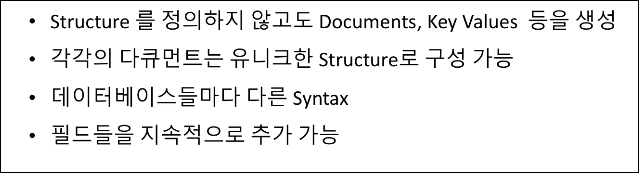

### Scalability
- SQL은 처리하는 데이터의 양이 늘어남에 따라 여러 스펙들 (CPU, RAM)에 대해 신경써줘야 함
- NoSQL은 파티셔닝을 통해(처리하는 아티스트의 종류만 나눠주면됨) 데이터의 양이 늘어난다고 해도 컴퓨터의 스펙에 대해 크게 신경쓰지 않아도 됨. 

    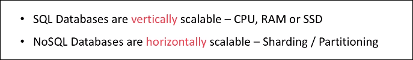

---

## Partition
> 데이터 매니지먼트, 퍼포먼스 등 다양한 이유로 데이터를 나누는 일

    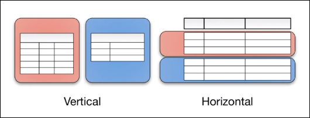

### Vertical Partition
> Going Beyound Normalization

- RDB에서 많이 쓰임
- 중복 데이터는 테이블을 나눠서 관리(normalization)

    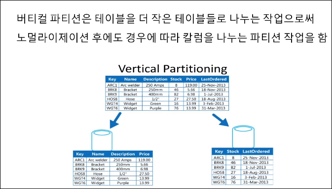
    - 정규화 후에도, 지속적으로 업데이트 되는것, 아닌것 등으로도 나눌 수 있음

### Horizontal Partition
> Schema /Structure 자체를 카피하여 데이터 자체를 Shared Key 로 분리

- RDB에선 잘 쓰이지 않으나 NoSQL에선 잘 쓰임

    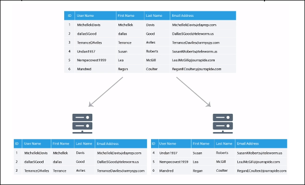
    - 컬럼은 같으나 데이터의 종류/특성마다 각기 다른서버에서 다룸
  
---

## DynamoDB - AWS SDK 
> AWS의 DynamoDB에 대해 알아보겠음

### DynamoDB Basics
- [AWS](https://us-east-2.console.aws.amazon.com/console/home?region=us-east-2)에 접속하여 Service에서 DynamoDB 찾기

    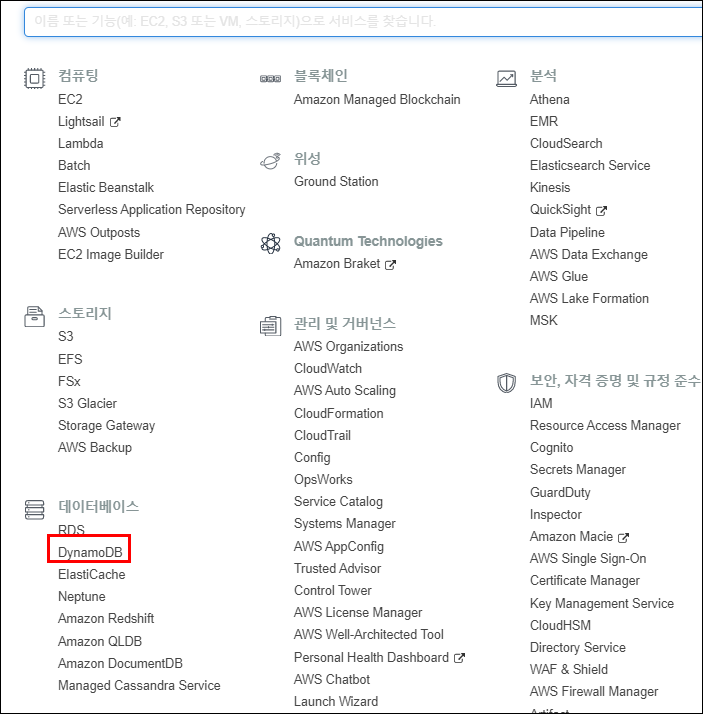

- 테이블 생성

    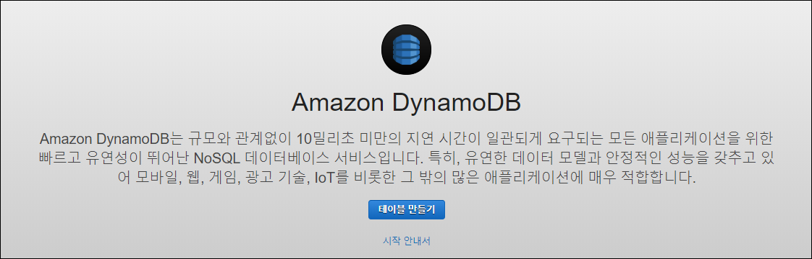
    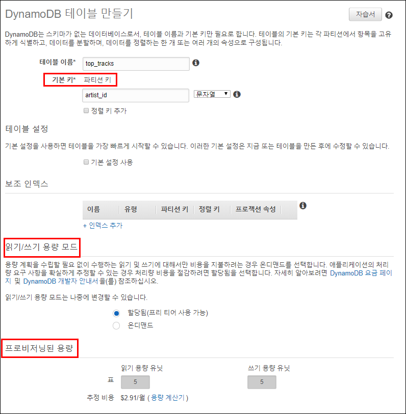
    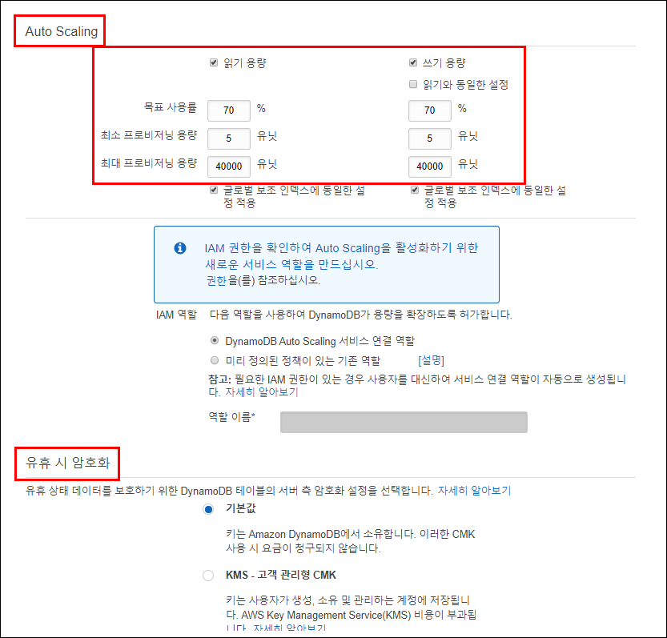
    - On-demand: 사용량에 따라 변환 가능, 알아서 바뀜, Auto Scaling (), 어느정도 쓰는지 모를때
    - Provisioned: 미리 사용량 예측 가능할 때

    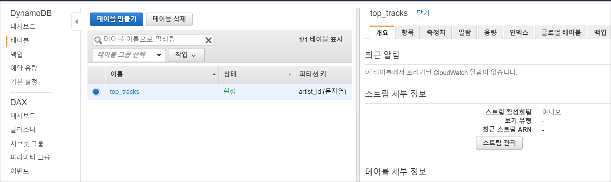
    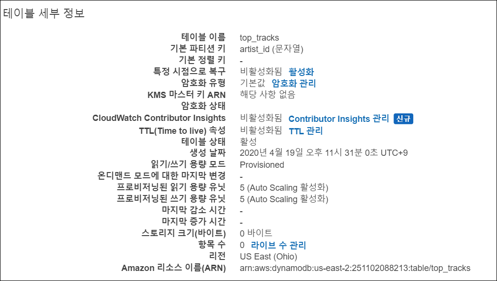
    - 생성완료!

