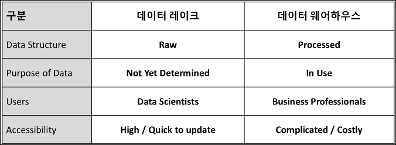
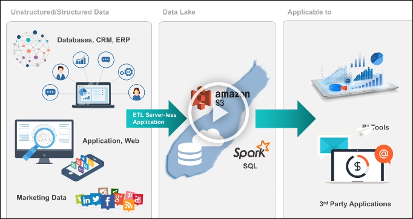
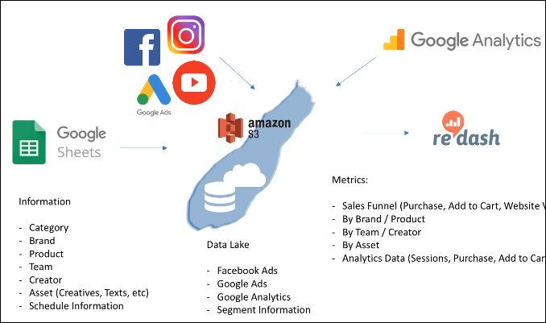
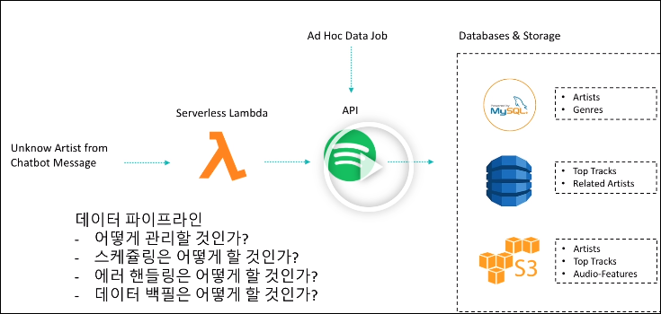

# Data-Engineering 11 - Data Lake

## Data Lake vs Data Warehouse
> 시대의 변화에 따른 데이터 저장 방식의 진화

- 많은 양의 데이터를 효율적으로 다루기 위해 나온 시스템
- 이전에는 이미 어떠한 데이터를 어떻게 쓸것이다 라는 것을 알고 수집했다면,
- 최근에는 정확히 어떤 목적을 가지고 수집하는것이 아닌,
- raw 데이터를 수집한 이후 해당 데이터들을 사용할 방법들을 찾아나감

### ETL -> ELT (?)
- 기존엔 Extract, Transform, Load 의 순서로 데이터를 수집/처리 했는데
- 요즘에는 Load가 Transform 보다 먼저 오는 경우도 많다고 함

    
    - 일단 여러 resorces 로 부터 다양한 데이터를 수집한 다음
    - 여러 데이터 처리 프로그램(Spark 등)으로 Transform 하는 과정을 거쳐 사용하자!

---

## Data Lake Architecture
> 현재 다양한 목적(협업, 분석, 수집 등)을 가진 툴들이 많은데 이러한 것들을 하나로 묶어 주는 것

### 다양한 협업 툴 그리고 데이터 그리고 API
- 여러 API를 통해 다양한 데이터 수집 및 통합
- 그렇게 모은 데이터를 어떻게 재가공해서 쓸것인지 고민
  
    

---

### Data Pipeline
- 데이터를 옮기는 것
- 데이터 파이프라인 관리시 생각해봐야 할 내용들이 많음
  
    
    - 데이터 백필: 데이터 수집중 에러가 났을때 손실된 데이터를 보완하는 것

