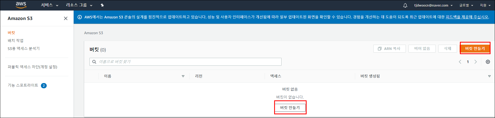
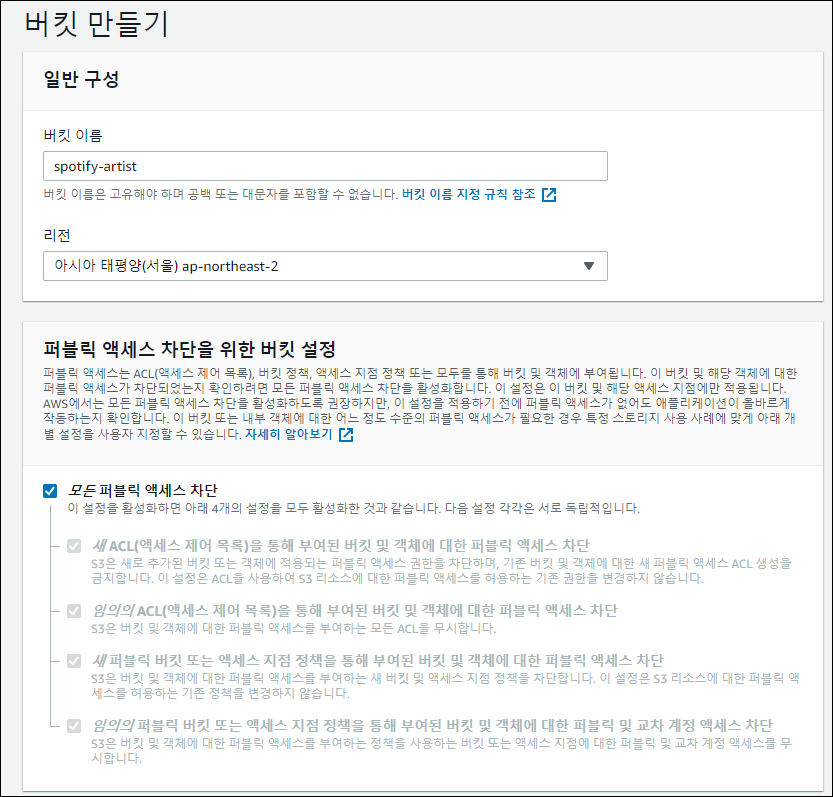
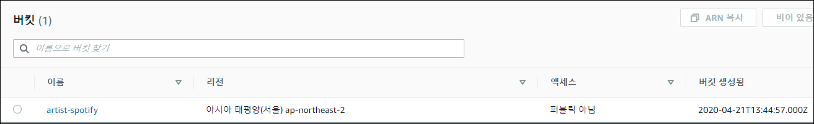
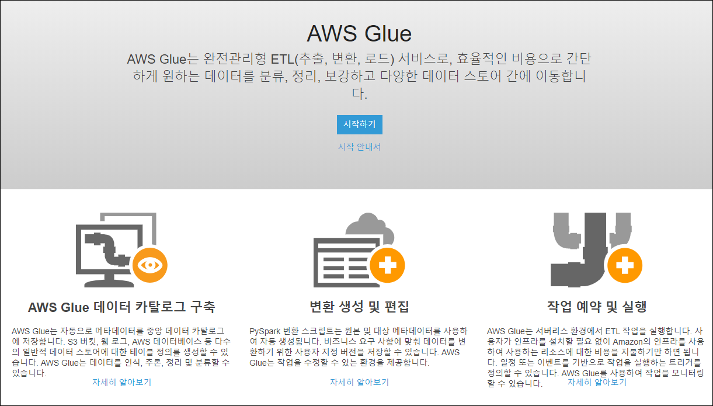
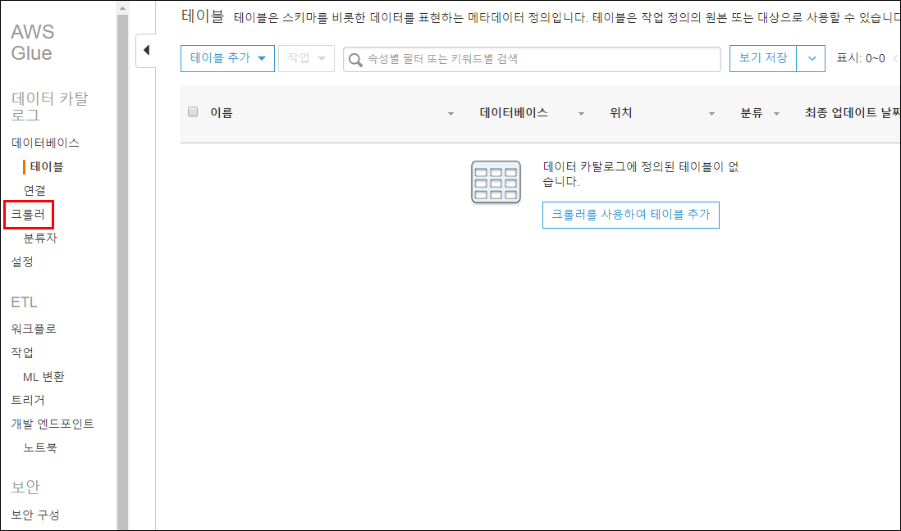
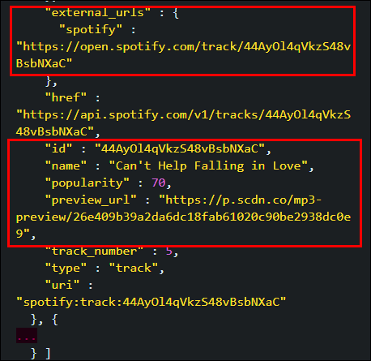
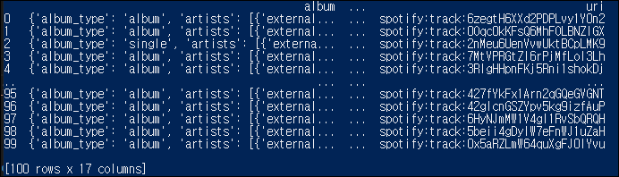
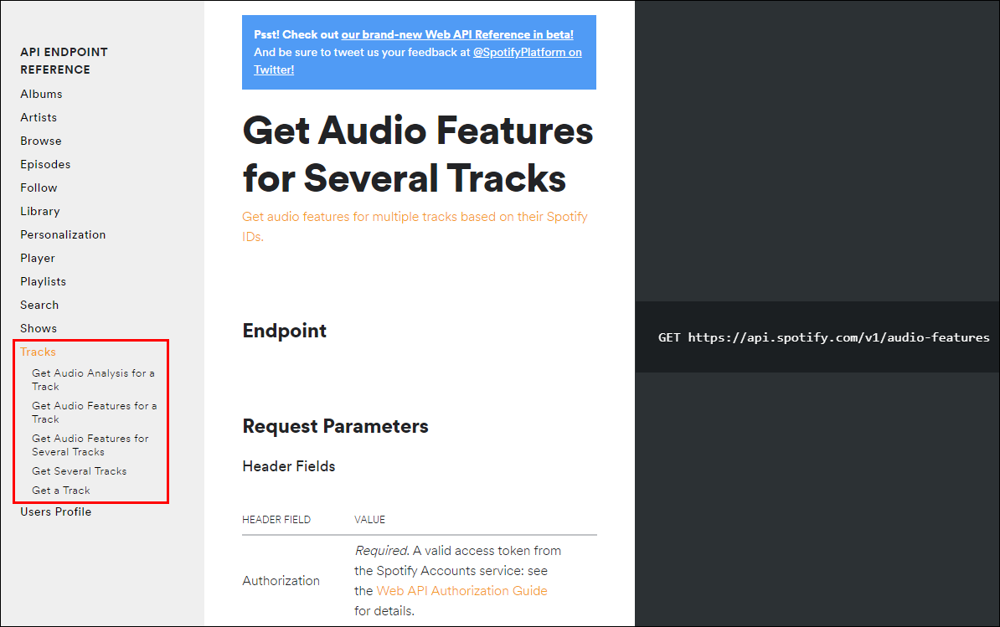
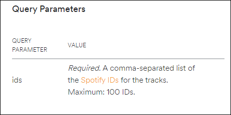

# Data-Engineering 12 - Building Data Lake

## AWS S3
> Symple Storage System의 약자, 우리가 만들 Data Lake의 주역?이 됨

### Buckets 생성
- S3 의 폴더 같은 존재
- 우리가 가지고 있는 다양한 데이터를 구분하고 관리하기 위해

    
    
    
    - artist-spotify 라는 이름의 버킷 생성
    - 해당 버킷 안에 여러 파티션들을 생성할것임
    - 파티션을 통해 Spark와 Arthena 등과 연동할 것임

---

### AWS Glue
- AWS 서비스의 분석파트를 보면 있음
- 데이터 레이크로 넘어오면서, 데이터를 저장하는 형식 등이 따로 없었다가,
- 어느 시점부터 키값이 여러개 생긴다는 등의 변화가 생길때,
- AWS Glue를 통해 테이블의 스키마 등도 관리하고, 다른 서비스들과의 연동도 시킴

    
    
    - Crawler: 어떤 테이블에 변화가 생기면 알아서 Detect하고 새로운 데이터/ 테이블을 가져올때 바로 반영시켜줌

---

## S3 in Python
> 파이썬으로 S3를 다뤄보겠음

### 연동

    ```python
        # RDS(MySQL) - 아티스트 ID 를 가져오고
        cursor.execute('SELECT id FROM artists')

        # unixtime , 파티션 파악을 위해 시간값을 넣어줘야함
        dt = datetime.utcnow().strftime('%Y-%m-%d')

        # Spotify API를 통해서 데이터를 불러오고


        # .json 타입으로 저장, list of dictionary
        # top_tracks.json이라는 파일이 생기고 거기서 부터 딕셔너리가 한줄한줄 쭉 들어감
        with open('top_tracks.json', 'w') as f:
            for i in top_tracks:
                json.dump(i ,f)
                f.write(os.linesep)

        # 위에서 만든 json 전체를 S3로 inport
        s3 = boto3.resource('s3')

        # 버켓 불러오기
        # readable한 dt(datetime) 파티션을 만들어놔야함(특히 지속적으로 업데이트 되는 데이터들)
        object = s3.Object('artist-spotift', 'dt={}/top-tracks.json',format(dt))
        data = open('top-tracks.json', 'rb')
        object.put(Body=data)

    ```
---

### JSON, Parquet
- 위에서는 Json파일로 저장후 S3로 옮기는 방법을 썻는데, 
- 이번엔 Spark에 좀더 친화적인 포맷인 Parquet으로 변형하고 압축(compression)하여 퍼포먼스를 늘리는 방법을 보겠음

    ```python
        # pandas 패키지 임포트 해줘야 함

        # RDS(MySQL) - 아티스트 ID 를 가져오고
        cursor.execute('SELECT id FROM artists')

        # unixtime 
        dt = datetime.utcnow().strftime('%Y-%m-%d')

        # Top Tracks - Spotify 가져오고


        # List of dictionaries, Parquet화
        top_tracks = pd.DataFrame(raw)
        top_tracks.to_parquet('top_tracks.parquet', engine='pyarrow', compressions='snappy')

        # S3에 import
        s3 = boto3.resource('s3')
        # 버켓 불러오기 (기존의 json이 아닌 parquet으로)
        object = s3.Object('artist-spotift', 'dt={}/top-tracks.parquet',format(dt))
        data = open('top-tracks.parquet', 'rb')
        object.put(Body=data)
    ```


### parquet화 해서 데이터 가져와보기
- pandas와 pyarrow 패키지 우서 설치해줘야 함
- parquet화 해주는게 성능도 좋아지고 빠르기때문에 장점이 많지만 그만큼 feature 값들을 정확하게 지정을 해줘야 한다는 부분 꼭 신경써야함

    
    - top-tracks에서 가져올 정보
  
- 코드
    ```python
        # Top Tracks - Spotify 가져오고
        top_tracks = []
        for (id, ) in cursor.fetchall():

            URL = 'https://api.spotify.com/v1/artists/{}/top-tracks'.format(id)
            params = {
                'country' : 'US'
            }
            r = requests.get(URL, params=params, headers=headers)
            raw = json.loads(r.text)
            # 한줄 한줄씩 추가해주기
            top_tracks.extend(raw['tracks'])


        # List of dictionaries, Parquet화
        top_tracks = pd.DataFrame(raw)
        top_tracks.to_parquet('top_tracks.parquet', engine='pyarrow', compression='snappy')

        sys.exit(0)
    ```
    
    - 코드 실행 결과

- jsonpath 사용

    ```python
        # jsonpath 패키지를 통해, 해당 path안에서 데이터를 가져올때,
        # 지정된 키를 참고하여 좀 더 빠르고 쉽게 가져옴
        top_track_keys = {
            'id': 'id',
            'name': 'name',
            'popularity': 'popularity',
            'external_url': 'external_urls.spotify' 
        }

        # Top Tracks - Spotify 가져오고
        top_tracks = []
        for (id, ) in cursor.fetchall():

            URL = 'https://api.spotify.com/v1/artists/{}/top-tracks'.format(id)
            params = {
                'country' : 'US'
            }
            r = requests.get(URL, params=params, headers=headers)
            raw = json.loads(r.text)

            for i in raw['tracks']:
                top_track = {}
                for k,v in top_track_keys.items():
                    # k, key로 jsonpath 사용하여 v,value에 바로 접근/찾음
                    top_track.update({k: jsonpath.jsonpath(i, v)})
                    top_track.update({'artist_id': id})
                    top_tracks.append(top_track)
    ```

---

### Audio Feature 가져오기
- Batch 형식이 가능하다면 Batch 형식을 쓰는게 속도면에서 이득 (max 100개)

    
    
