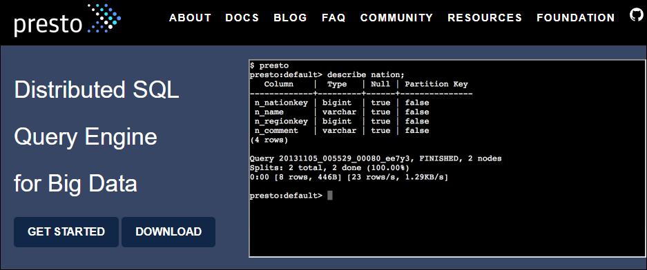
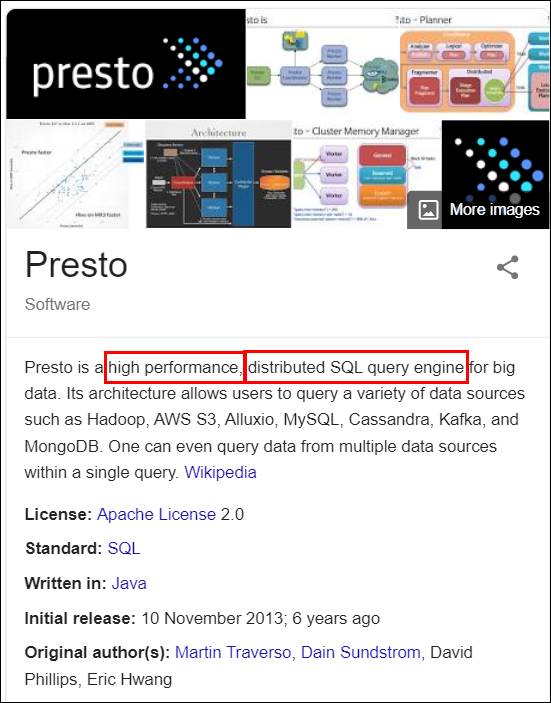
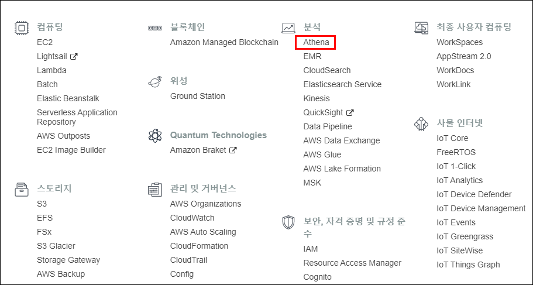
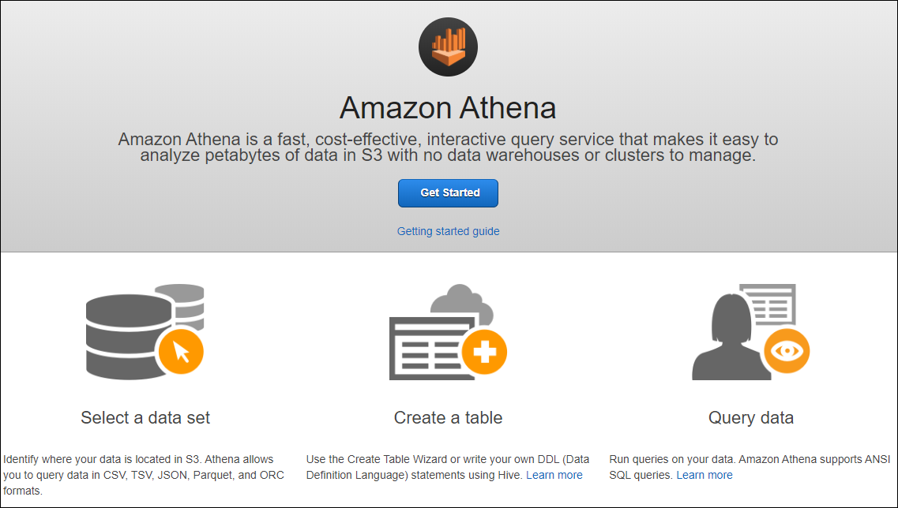
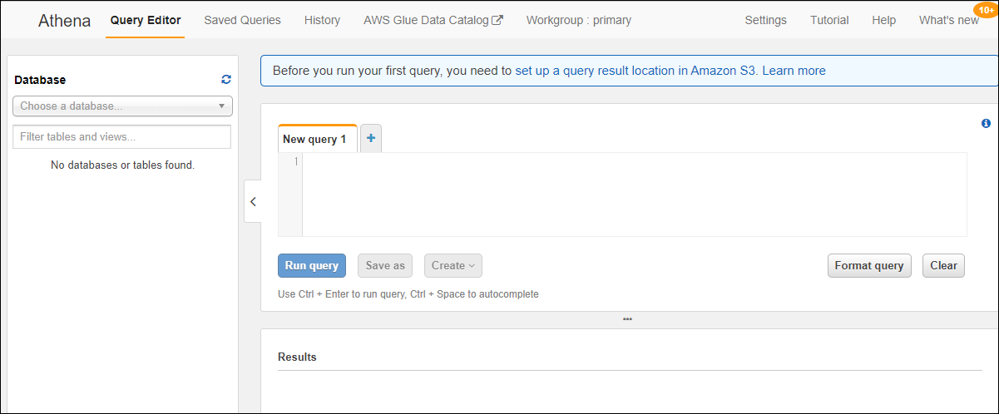
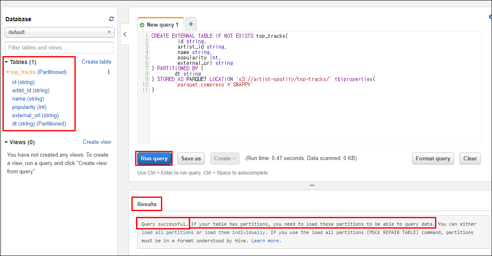
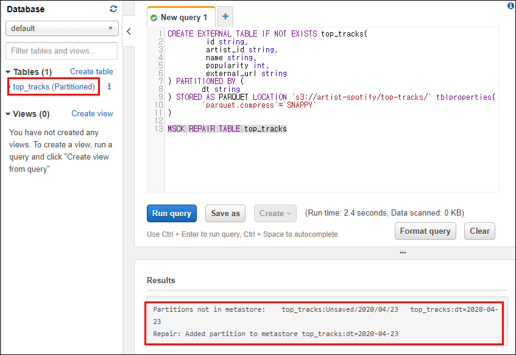
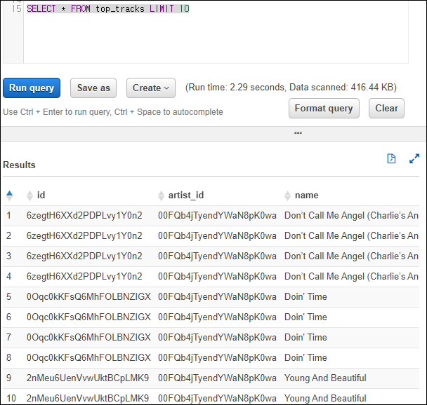
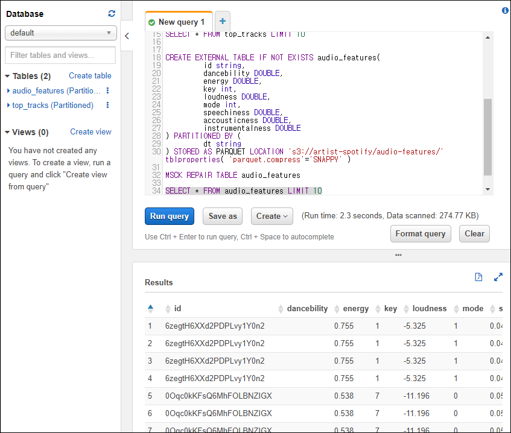

# Data-Engineering 13 - Athena

## Presto란?
> SQL query engine

> 나뉘어 저장된 여러 데이터들을 쿼리를 사용해 관리할수 있게 해줌

### Distributed SQL Query Engine for Big Data
- [Presto](https://prestodb.io/) 페이지

    
    

- 하나의 쿼리로 여러 데이터 소스들을 관장할 수 있음

- 우리가 사용할 AWS의 Athena가 바로 Presto 기반으로 만들어짐

---

## Serverless (Athena, AWS Lambda)
> 서버가없다?

> 서버가 항상 켜져있을 필요 없이, 작동이 필요할때만 운영

### Serverless 서비스의 필요성
- 물리적 서버를 24시간 가동시키는것의 제한점
- 가변성의 필요성(서버 확장, 성능 개선)
- 공간적인 제한 없음, 접근성의 장점
- 유지/보수/관리의 장점
- 사용한 만큼만 과금

---

## Athena
> AWS의 presto기반 Serverless 서비스 중 하나

### Athena 개요
- AWS 서비스의 분석파트에 위치

    
    
    
    - 여러 소스로부터 데이터를 가져와 테이블을 만들고 
    - 한번의 쿼리로 모든 데이터를 한번에 다룰 수 있음

### 테이블생성
- 테이블생성 쿼리 작성

    ```sql
        CREATE EXTERNAL TABLE IF NOT EXISTS top_tracks(
                id string,
                artist_id string,
                name string,
                popularity int,
                external_url string 
        ) PARTITIONED BY (
                dt string
        ) STORED AS PARQUET LOCATION 's3://artist-spotify/top-tracks/' tblproperties(
                'parquet.compress'='SNAPPY'
        )
    ```
    
    - 쿼리 작성후 실행하면 하단에 결과가 나오고 메세지 출력됨
    - 좌측에는 쿼리로 생성한 테이블이 표시됨
  
- 테이블에 파티션이 있다면 load 해야 한다고 함
  - 파티션이 추가되면 추가된지 모르니까 따로 load 해줘야함
  
  ```sql
     MSCK REPAIR TABLE top_tracks
  ```
    
    - 쿼리 실행하면 파티션이 추가됫다는 메세지 출력
    - 추후에 우리가 데이터를 매일매일 넣어줄때, 일자별로 dt가 새로 생김
    - 데이터 수집하는 단계에서 Athena에 위의 쿼리문을 자동으로 실행하는 코드 넣어줘야 함

- 테이터 확인
    
    
    - 파이션인 dt가 테이블 끝쪽에 자동으로 들어가 있는데 
    - 이것을 이용해 필터를 해줄수도 있음
  
  ```sql
    SELECT * FROM top_tracks
    WHERE CAST(dt AS date) >= CURRENT_DATE - INTERVAL '7' DAY
    LIMIT 10
  ```
    - 최근 7일간 생성된 데이터만 가져오기

- Audio_features 테이블 생성

    
    - top_tracks와 동일한 방법으로, 항목만 다르게 생성


