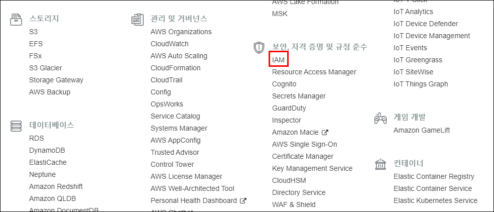
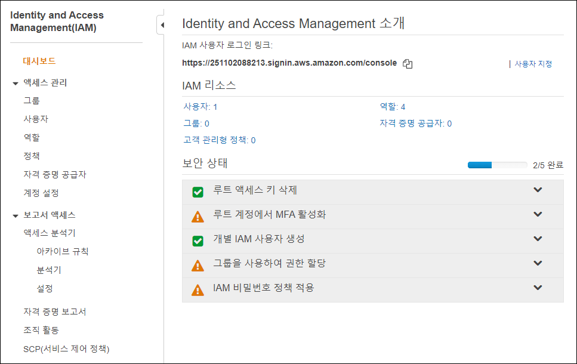

# Data-Engineering 14 - Apache Spark

## Apache Spark란?
> 빅데이터를 처리하는 하나의 시스템, 하둡의 속도적인 부분을 개선한 진화버전(?)

### Spark Overview
- 방대한 데이터를 효율적으로(시간, 비용) 처리하기 위해 쓰임

    

- 우리는 스파크 기반의 웹 UI인 Zeppline을 쓸것임
    - 스파크로 처리하는 것을 시각적으로 확인가능

### Map Reduce
- 데이터가 방대한 양으로 늘어날때, 해당 데이터를 처리하는 방식에서 고려해야할 부분이 많음
- 좀더 효율적으로 처리하기 위해 데이터를 맵핑, 병렬적으로 처리, reducing 하는 방법
  
    
    - 데이터가 여러개로 쪼개져 있음(partition)
    - node: 병렬적 데이터 처리를 위한 processing term, 저장공간

- ex)
  
    
    - input -> map -> shuffle -> reduce -> output
    - 구글의 page rank, word count

---

## AWS EC2, Apache Zeppelin
> 

### Zeppelin, Spark 설치하기
- AWS의 EMR(Elastic Map Reduce)이라는 서비스를 통해 Zeppelin과 Spark를 설치해보겠음
  - EMR: 스파크, 하둡 시스템의 클러스터를 만들어주는 곳
  - 클러스터: 서버, EC2 등의 가상서버 등

    

- EMR을 다루기전에 잠깐 보안쪽의 IAM이라는 서비스에 먼저 접근
  - IAM (Identity and Access Management): AWS 어카운트 안에서의 유저관리, 서비스를 만들때의 권한, 접근을 관리하는 곳

    
    
    

- IAM에서 기존에 AWS CLI를 만들떄 설정했던 User 정보를 볼 수 있음
    - 내가 가진 권한, Status등 확인가능
    - 이러한 권한을 가지고 있어야 EMR 등에서 만드는 클러스터, 서비스 등에 접근가능

- 다시 EMR로 돌아와서, 클러스터 생성하기

    
    
    - (강의영상에선)서울리즌은 아직 memory optimize가 되지 않는다하고,
    - Spark를 쓴다는것 자체가 대용량 데이터를 다루는 것이 목적이라 (Spark install만 4Gb) 기본적으로 용량이 괜찮은 C4 Large 선택함
    - 더 높고 좋은것도 많지만 비용적인 부분을 신경써야함...

#### EC2 Key pair 생성
  - 클러스터 생성을 마무리 하기 위해선 EC2 Key pair를 생성해줘야 함
  
    
    
    
    
    
    - EC2 콘솔로 이동 후 키페어 생성
    - 파일 형식은 PEM으로 선택
    - 키 페어 생성하면 바로 PEM 파일이 자동다운로드가 됨 
  
    
    - 윈도우의 경우 해당부분 참고하여 진행
    - 내용이 길어져서 이부분은 정리하지 않음
  

  -  

